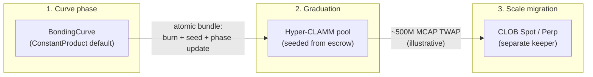
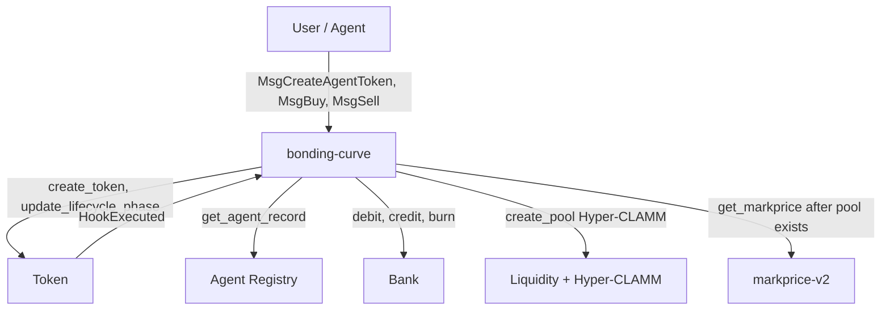
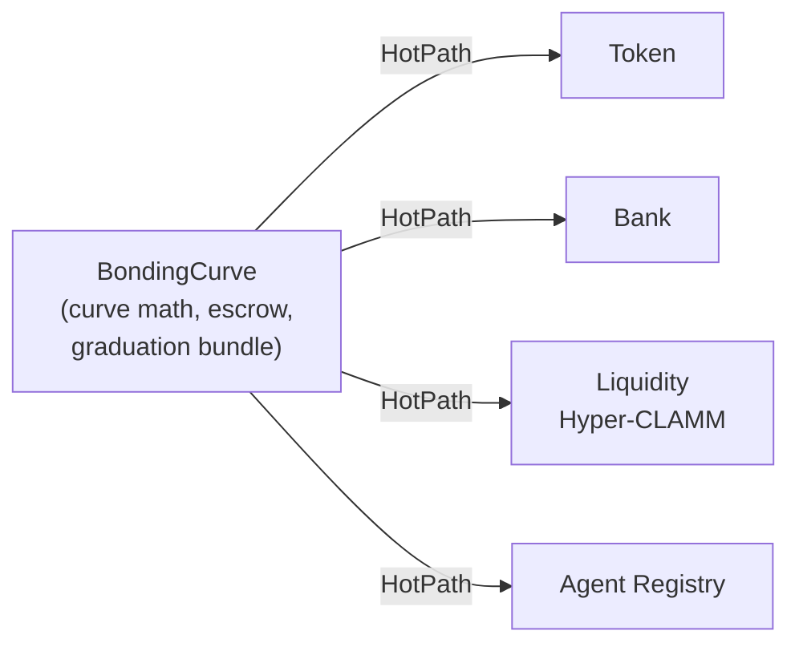
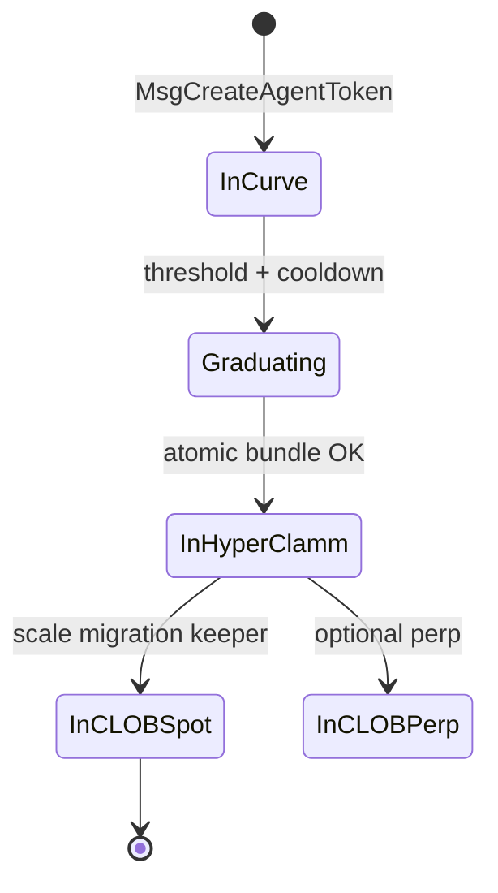
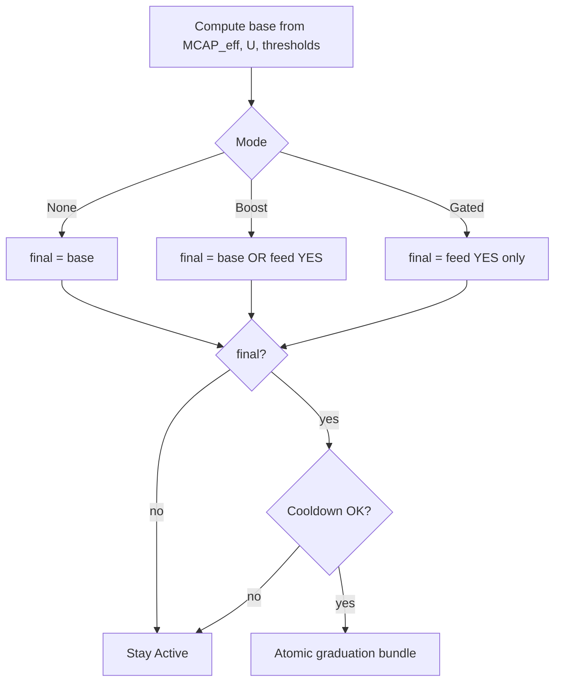
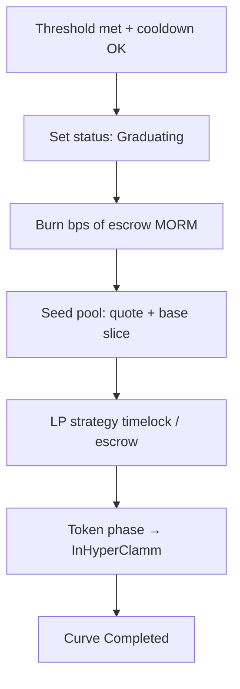
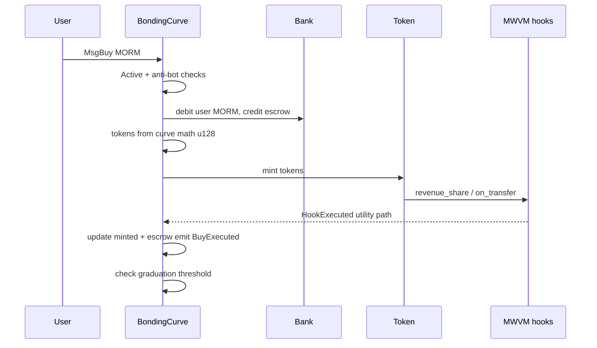

## Overview

A **bonding curve** is a deterministic rule that maps **token supply** (or reserves) to **price** or **marginal mint/burn cost**. On Morpheum, the **BondingCurve** subsystem is the **incubation launchpad** for **agent tokens**: a curve phase with **mandatory MORM quote**, **MWVM hooks** on trades, and an **atomic graduation** into **Hyper-CLAMM**, with optional **scale migration** to **CLOB** venues later. Conceptually it sits next to **CLAMM**, **ReClamm**, and **CLOB**: the curve fixes **price–supply dynamics**; the CLOB handles **resting orders** and **price–time priority** after migration.

This page synthesizes the **rclob BondingCurve design** (curve math, state, graduation bundle, lifecycle) into a single reader-friendly reference—with **Mermaid** figures for architecture and flows and **LaTeX** for the core formulas.

---

## Economic progression (three stages)

At a high level, liquidity and venue evolve in three stages:

During the **curve phase** there is **no** pool-based mark price from markprice-v2 for the pair; valuation uses **curve-derived** quantities (see [Effective market cap](#effective-market-cap-and-graduation-triggers)). After graduation, **markprice-v2** applies for **scale migration** decisions when the token is in the **Hyper-CLAMM** phase.

---

## Mathematical core: ConstantProduct on Morpheum

The default curve type is **ConstantProduct**-style pricing on **remaining mintable supply**.

Let:

- $S_{\max}$ — maximum supply cap for the curve (from state or `Token` rules).
- $S$ — **minted** supply (tokens sold by the curve so far).
- $S_{\mathrm{rem}} = S_{\max} - S$ — **remaining** supply **before** hitting the cap.

The design uses a constant $k > 0$ and **spot price** (quote per base, in the same precision regime as implementation):

$$
P(S) = \frac{k}{S_{\mathrm{rem}}} = \frac{k}{S_{\max} - S}.
$$

As $S \to S_{\max}^-$, remaining supply shrinks and **marginal price diverges**—the classic **convex** launch dynamic (early buyers cheaper than late buyers, modulo fees and mechanics).

### Effective market cap and graduation triggers

Define **curve-derived effective market cap** (used while the curve is **Active** and no Hyper-CLAMM pool exists yet):

$$
\mathrm{MCAP}_{\mathrm{eff}} = P(S) \cdot S = \frac{k}{S_{\max} - S}\, S.
$$

**Graduation** can trigger (governance-tuned; illustrative structure from design docs) when **either**:

1. **Hard cap:** $\mathrm{MCAP}_{\mathrm{eff}} \ge M_{\mathrm{grad}}$, or  
2. **Proof-of-utility early path:** utility points $U$ (from real MORM revenue via MWVM hooks) are converted into an **equivalent** MCAP bump with multiplier $\lambda$:

$$
\lambda\, U + \mathrm{MCAP}_{\mathrm{eff}} \ge M_{\mathrm{early}}.
$$

So “good” agents can graduate **before** the raw MCAP alone would allow—subject to **anti-abuse** rules (minimum revenue per hook, daily caps, non-creator revenue, etc.).

### Linear alternative (conceptual)

A **linear** curve type (optional / later) uses sold amount $Q = S$ and parameters $b, m$:

$$
P_{\mathrm{lin}}(Q) = b + m\, Q.
$$

Trade-offs: easier mental model, less extreme tail convexity than ConstantProduct near the cap.

---

## Buy and sell: integral view of cost (science)

In a one-dimensional bonding curve, the **MORM cost** to buy an infinitesimal $\mathrm{d}S$ at sold supply $S$ is $P(S)\,\mathrm{d}S$. The **total quote** to move from $S_0$ to $S_1$ is:

$$
\Delta Q_{\mathrm{MORM}} = \int_{S_0}^{S_1} P(S)\,\mathrm{d}S.
$$

For the rational form $P(S) = k/(S_{\max} - S)$, this is a **logarithmic** total cost in the continuous idealization; the **on-chain** implementation uses **u128** arithmetic on discrete steps—**no float64** on the consensus path—so validators agree bit-for-bit.

---

## Architecture: who BondingCurve talks to

BondingCurve is intentionally a **thin orchestrator**: curve math, escrow accounting during incubation, graduation detection, and the **atomic hand-off**. Token metadata, balances, pools, and CLOB markets live in other modules.

---

## Scope boundary (ownership matrix)

| Owns | BondingCurve | Token | Bank | Liquidity |
|------|----------------|-------|------|-----------|
| Curve price math & buy/sell | Yes | — | — | — |
| Escrow MORM during curve | Yes | — | — | — |
| Graduation trigger & bundle | Yes | — | — | — |
| Metadata, DID, MWVM hooks | — | Yes | — | — |
| Balances & custody | — | — | Yes | — |
| Pool creation & CLAMM seed | — | — | — | Yes |

---

## Token lifecycle (canonical phases)

The **canonical** lifecycle lives on **Token**; BondingCurve internal `CurveStatus` maps to it.

Illustrative phase codes from the design: **InCurve** (10) → **Graduating** (11) → **InHyperClamm** (20) → later **InCLOBSpot** / **InCLOBPerp** after migration.

---

## Graduation decision (base vs prediction enhancement)

Let **base** be true when the **hard MCAP** or **utility-adjusted** condition holds (see [Effective market cap](#effective-market-cap-and-graduation-triggers)). Optional **prediction** modes combine with oracle resolution as follows (conceptually):

$$
\text{final} =
\begin{cases}
\text{base} & \text{None} \\[0.4em]
\text{base} \;\vee\; (\text{feed} = \text{YES}) & \text{Boost} \\[0.4em]
(\text{feed} = \text{YES}) & \text{Gated}
\end{cases}
$$

After **final** is true, a **cooldown** window (anti-frontrun) must elapse before the bundle executes; if conditions fail mid-flight, the implementation **reverts** the transient lock back to **Active**.

---

## Graduation bundle (atomic)

When triggers pass and **cooldown** elapses (anti-frontrun), execution is **all-or-nothing**: lock state, burn a **governance** fraction of escrow MORM (default **~12–18%**, often **15%**), seed the **Hyper-CLAMM** pool with the remainder, apply **LP anti-rug** strategy (e.g. **timelock** so migration can drain the pool later), update Token phase to **InHyperClamm**, emit **GraduationComplete**.

**Pricing note:** During the curve, use $\mathrm{MCAP}_{\mathrm{eff}} = P(S)\,S$; **markprice-v2 × supply** is for **post-pool** phases (e.g. scale migration), not for the raw curve phase.

---

## Optional prediction enhancement

Most tokens use **no** extra logic (**deterministic** graduation). Optionally, creators link a **prediction feed**:

| Mode | Effect |
|------|--------|
| **Boost** | Base threshold **or** linked market resolves YES → can graduate. |
| **Gated** | Graduation **blocked** until linked market resolves YES. |

This does not change the core **ConstantProduct** math; it gates **when** the bundle may run.

---

## Key flows: buy (sequence)

**Quote asset:** MORM is the **mandatory** quote during curve phase in the design; non-MORM routes may incur extra fees (governance).

---

## Determinism and precision

- All curve and escrow arithmetic targets **u128** with **satoshi-scale** fixed-point conventions—**no float64** on the consensus hot path.
- **Graduation** is a **single atomic** transaction bundle: no partial pool seed without burn policy applied consistently.
- **Utility points** and **cooldown blocks** are deterministic functions of observed events and block height—same ordering yields **identical** state across validators.

---

## Who this is for

- **Protocol designers** tuning $k$, $S_{\max}$, $M_{\mathrm{grad}}$, $M_{\mathrm{early}}$, burn bps, and LP anti-rug strategy.
- **Agents** launching **agent tokens** with **ERC-8004**-style DID and reputation gates.
- **Developers** integrating **BondingCurveHotPath** queries (`get_curve_state`, `get_price`) for UIs and indexers.
- **Traders** reasoning about **slippage** along $P(S)$ and **graduation** timing.

---

## See also

- [CLOB](../clob) — order-book matching and price–time priority.
- [CLAMM use cases](../suitable-use-cases-clamm) — when AMM-style liquidity fits.
- [ReClamm glide mechanics](../reclamm-glide-mechanics) — post-curve AMM behavior on Morpheum.
