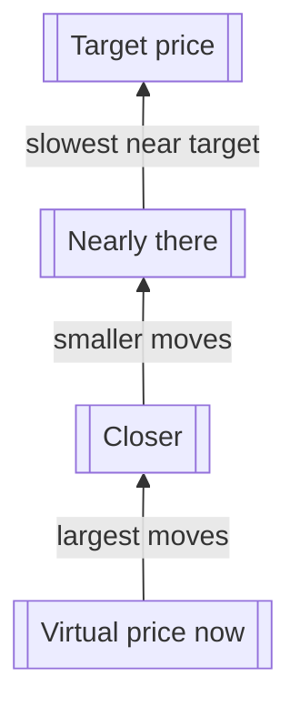

## Overview

**ReClamm** (Re-Centering Liquidity AMM) introduces a mechanism called **glide** (also referred to as gradual / time-proportional recentering) whose goal is:

> Automatically and smoothly move the virtual liquidity center of the pool toward a target price **without** creating large, sudden arbitrage opportunities and **without** requiring active LP management.

This is one of the biggest differences compared to classic Uniswap v3 concentrated liquidity (which is static until the LP manually moves ranges) and classic constant-product AMMs (which have no concept of preferred center at all).

---

## Core idea in one sentence

**The pool slowly "glides" its virtual balances toward a target price center using an exponential decay function — the farther the current price is from the target, the faster it wants to move back, but the movement is always gradual and time-proportional.**

---

## Key concepts and variables

| Symbol | Meaning | Typical default / range | Controls what? |
|--------|---------|--------------------------|----------------|
| **T** | Target price (the "desired" center of the pool) | oracle price, TWAP, governance vote | where the pool wants to be |
| **Vₐ, Vₓ** | Current virtual balances of token A and token B | dynamic | virtual liquidity depth on each side |
| **Rₐ, Rₓ** | Real (actual deposited) balances of token A and token B | real LP deposits | real economic exposure |
| **c** | Centeredness metric (how balanced the virtual liquidity is) | 0 … 1 (ideal = 1) | trigger condition for glide |
| **m** | Minimum centeredness margin | 0.75 – 0.85 | when glide is activated |
| **τ** | Daily shift exponent / decay rate | 0.3 – 0.7 | how aggressive the recentering is per day |
| **Δt** | Time elapsed since last glide (in days) | fraction of day | controls speed of movement |

---

## Centeredness formula (the trigger)

Most implementations use one of these two equivalent definitions:

$$
c = \min\left( \frac{R_a \cdot V_b}{R_b \cdot V_a},\ \frac{R_b \cdot V_a}{R_a \cdot V_b} \right)
$$

or the more symmetric version

$$
c = \frac{2}{\frac{R_a V_b}{R_b V_a} + \frac{R_b V_a}{R_a V_b}}
$$

- **c ≈ 1** → virtual liquidity is well balanced  
- **c ≪ 1** → the pool is very imbalanced (one side has almost all virtual liquidity)

**Glide is only activated when c &lt; m** (e.g. c &lt; 0.80–0.85).

---

## The glide update rule (core mathematics)

When glide is triggered, the virtual balances are updated using **exponential decay** toward the target:

$$
V_{a,\ \text{next}} = T_a + (V_{a,\ \text{current}} - T_a) \cdot (1 - \tau)^{\Delta t}
$$

$$
V_{b,\ \text{next}} = T_b + (V_{b,\ \text{current}} - T_b) \cdot (1 - \tau)^{\Delta t}
$$

Where usually **Tₐ** and **Tₓ** are chosen such that

$$
\frac{T_a}{T_b} = \text{target price (in token B / token A)}
$$

**Most important properties of this formula**

1. **Asymptotic convergence** → Vₐ and Vₓ approach Tₐ and Tₓ exponentially  
2. **The larger the deviation** (|V – T|), **the larger the absolute step** → strong restoring force  
3. **The step size decays exponentially** → movement becomes slower and slower → **no sudden jump**  
4. **Time-proportional** → twice the time → roughly twice the distance covered (in log scale)

---

## Typical values seen in production designs

| Parameter | Conservative (stable pairs) | Aggressive (volatile / meme) | Very aggressive (new launch) |
|-----------|-----------------------------|------------------------------|------------------------------|
| m (min centeredness) | 0.82 – 0.87 | 0.75 – 0.80 | 0.65 – 0.75 |
| τ (daily exponent) | 0.30 – 0.45 | 0.50 – 0.70 | 0.80 – 1.00 |
| Min glide interval | 4–12 hours | 1–4 hours | 15 min – 1 hour |
| Max glide per trigger | ~3–8% of virtual depth | 10–25% | 30–50% |

---

## Visual intuition – how the glide looks

Imagine the virtual price starts **below** the target and moves **up** over time. Think of the target as the top rung and the glide as climbing toward it: each step is **largest** when you are far away and **smallest** when you are almost there.

**Time** runs along the journey (left to right in the story, bottom to top in the diagram): the farther below target you start, the faster the **absolute** correction feels at first; near the target, movement **asymptotically** slows so there is no sudden snap.

---

## Why this is powerful (ReClamm advantages)

| Property | Classic Uniswap v3 | Classic x*y=k | ReClamm glide |
|----------|--------------------|---------------|---------------|
| Needs active LP to re-range? | Yes | No | **No** — automatic |
| Sudden large arb opportunity? | When LP moves | Always | **Very small** — gradual |
| Capital efficiency during drift | Drops fast | Constant | **Stays high** — virtual recenters |
| Good for trending markets? | Poor | Poor | **Good** — follows slowly |
| Good for range-bound stablecoins? | Good | Ok | **Excellent** — stays centered |
| Good for high-vol meme launches? | Very poor | Poor | **Very good** — damps extremes |

---

## Most important engineering trade-offs

1. **Too high τ** → pool chases price too aggressively → large arb during strong trends  
2. **Too low τ** → pool stays imbalanced for too long → bad capital efficiency  
3. **Too low m** → glide almost always active → unnecessary state writes / computation  
4. **Too high m** → glide almost never triggers → defeats the purpose

**Sweet spot (most production designs)**  
→ m ≈ 0.78–0.84  
→ τ ≈ 0.45–0.65 (daily)  
→ glide triggered at most once per 1–4 hours

---

## Further exploration

Related topics you can go deeper into:

- How the glide affects **effective slippage** in different market regimes  
- A numerical example with concrete numbers over 3 days  
- How to choose τ and m given historical volatility of the pair  
- Main failure modes / attack vectors when implementing glide

See the internal ReClamm design docs for deeper detail.
