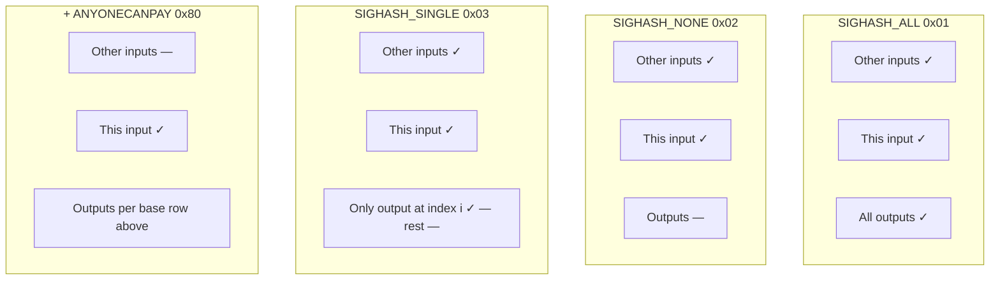
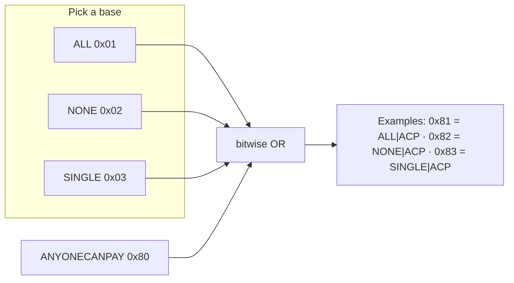
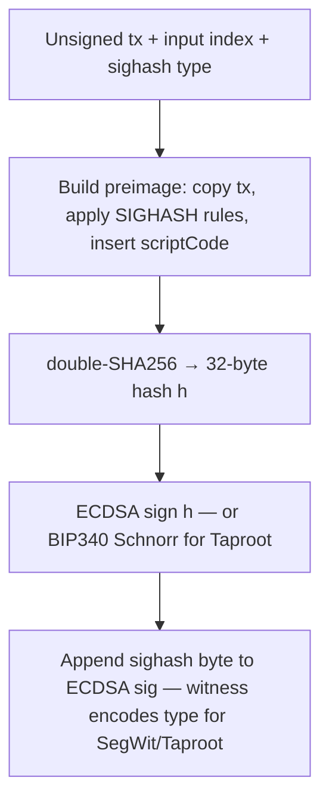
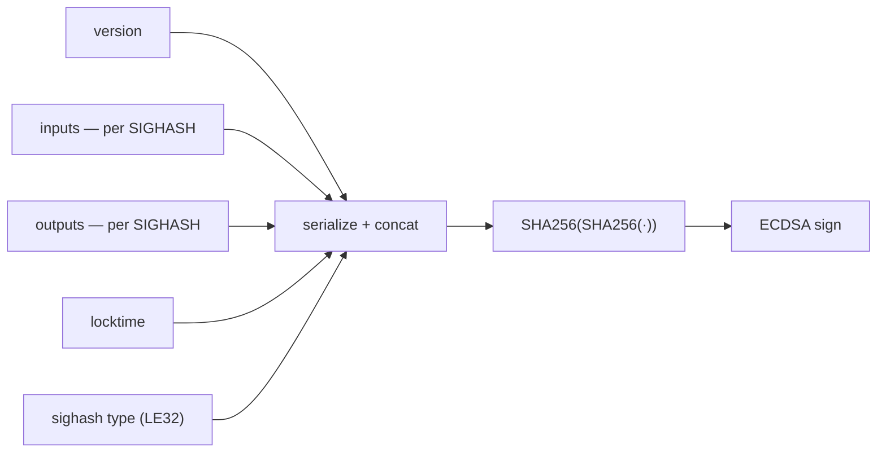

## Overview

**Bitcoin** does not use an account/balance model like many EVM chains. Authorization is **per input**: each spend of a **UTXO** (unspent transaction output) must include cryptographic proof that the spender satisfies the **locking script** (for standard payments, a public-key hash or script path) attached to that coin. The signer does **not** “sign the whole transaction” as a single opaque blob in the same way as a Solana message—instead, for each input, the wallet builds a **sighash** (signature hash) from a deterministic recipe that mixes the **input index**, **prevout** (prior transaction id and output index), **spending script**, **sighash type**, and (per the type) parts of the **outputs** or other inputs.

**SegWit** (BIP143 / BIP341) and **Taproot** change **exactly** how that sighash is computed and where signatures live (**witness** stack vs legacy `scriptSig`). **P2WPKH**, **P2WSH**, **P2TR** key-path, and **P2TR** script-path each imply different verification paths.

This page is **orientation only**; for byte-level consensus rules, rely on **Bitcoin Core** documentation and **BIPs** for your stack.

---

## Digital signatures and UTXO authorization

Bitcoin transactions are authorized through **digital signatures**. When you spend bitcoin from a UTXO, your wallet creates a cryptographic signature using your private key. This proves you control the funds without revealing the key.

The signature is created by:

1. Building a **sighash preimage** — a carefully modified copy of the transaction data (per consensus rules for legacy vs SegWit vs Taproot).
2. Hashing it twice with SHA-256 (**double-SHA256**), producing a 32-byte message *h*.
3. Signing *h* with **ECDSA** (legacy / SegWit v0) or **Schnorr** (Taproot key path, BIP340).

The **SIGHASH flag** (a 1-byte value appended to the signature in ECDSA flows; embedded in the sighash for SegWit/Taproot) tells Bitcoin *which parts* of the transaction go into the preimage. That decides what the signature protects and what other parties can change without invalidating your signature.

Bitcoin defines **four base SIGHASH flags** (see Bitcoin Core `script/interpreter.cpp` and related consensus code):

| Flag | Hex | What it signs | What it allows others to change |
|------|-----|---------------|----------------------------------|
| **SIGHASH_ALL** | `0x01` | All inputs + all outputs | Nothing (most secure / default) |
| **SIGHASH_NONE** | `0x02` | All inputs + **no** outputs | All outputs |
| **SIGHASH_SINGLE** | `0x03` | All inputs + **one** matching output | Other outputs |
| **SIGHASH_ANYONECANPAY** | `0x80` (modifier) | Only **this** input when combined with the three above | Other inputs |

`ANYONECANPAY` is combined with the base types via **bitwise OR**, yielding six common combinations in practice (`0x81`, `0x82`, `0x83` plus the three bases without it). Each input in a multi-input transaction can use a **different** SIGHASH flag.

### Visual: what each base type commits to

**✓** = included in the preimage (after SIGHASH-specific substitutions). **—** = omitted or replaced with a dummy. **ANYONECANPAY** applies on top of a base row: other inputs become **—**, only **this** input stays **✓**.

---

## SIGHASH types in detail

### 1. SIGHASH_ALL (`0x01`) — default and most secure

- **How it works**: The preimage includes the **entire** transaction (all inputs, all outputs, version, locktime, and the sighash byte). For the input being signed, the unlocking script (`scriptSig` / witness) is replaced with the **scriptCode** (the locking script you are satisfying) before hashing, per the relevant sighash algorithm.
- **Effect**: Any material change to committed fields invalidates the signature.
- **Use case**: Everyday wallets and single-party sends. This is what the vast majority of transactions use.
- **Preimage summary**: Full inputs + full outputs.

### 2. SIGHASH_NONE (`0x02`)

- **How it works**: The preimage includes all inputs but **does not commit to outputs** (outputs are cleared or set to sentinel values per the legacy vs BIP143 rules).
- **Effect**: You commit to spending your input(s), but anyone can change where the value goes.
- **Use case**: Multi-party flows where another signer (often using **SIGHASH_ALL**) fixes the outputs while you only attest to your inputs. Rarely used alone—it is dangerous for naive single-input transactions.
- **Preimage summary**: All inputs + no outputs.

### 3. SIGHASH_SINGLE (`0x03`)

- **How it works**: The preimage includes all inputs and **only the output at the same index** as the input being signed. Other outputs are replaced with dummies. If no output exists at that index, consensus uses a defined error/sentinel behavior (historically associated with the value `1` in legacy sighash)—**misuse breaks expected security guarantees**.
- **Effect**: You lock your contribution relative to **one** output index while allowing other outputs to change.
- **Use case**: Multiple parties combining inputs where each cares about “their” paired output (e.g. pooled payment with separate change paths).
- **Preimage summary**: All inputs + one matching output (by index).

### 4. SIGHASH_ANYONECANPAY (`0x80`) — modifier

Combined with the three bases, it **drops other inputs** from the preimage (they are replaced with dummies so only **this** input is bound).

| Combination | Hex | Commits to | Typical idea |
|-------------|-----|------------|--------------|
| **ALL \| ANYONECANPAY** | `0x81` | This input + **all** outputs | Others can add inputs (crowdfunding, topping up fees) |
| **NONE \| ANYONECANPAY** | `0x82` | **Only** this input | Everything else flexible—very strong trust assumptions |
| **SINGLE \| ANYONECANPAY** | `0x83` | This input + output at same index | Atomic swaps, trust-minimized trades, certain covenant-style patterns |

**Example pattern**: In a coordinated “sale” or swap, one party might sign with `SINGLE|ANYONECANPAY` so a counterparty can attach their input and complete the trade without resigning the whole transaction—**protocol design must pin fees, ordering, and output indices** so nothing unexpected becomes malleable.

---

## How the preimage becomes a signature

At a high level, signing one input looks like this:

### Legacy (non-SegWit) preimage — simplified layout

For **legacy** P2PKH/P2SH-style signing, the preimage is a concatenation of serialized fields; exact byte layout is in Bitcoin Core. Conceptually:

`[version] + [modified inputs] + [modified outputs] + [locktime] + [sighash type as 4-byte little-endian]`

- Inputs and outputs are **modified** according to the SIGHASH rules above.
- The current input’s `scriptSig` is replaced by the **scriptCode** (the scriptPubKey being spent, or redeem script for P2SH) for hashing purposes.
- **Double-SHA256** of that blob → ECDSA over secp256k1.

**SegWit** (BIP143, P2WPKH/P2WSH) and **Taproot** (BIP341, P2TR) use **different preimage layouts** (explicit amounts, `hashPrevouts` / `hashSequence` / `hashOutputs` in BIP143; `epoch` and annex handling in BIP341). The **semantic** roles of **SIGHASH_ALL / NONE / SINGLE / ANYONECANPAY** are the same: they still decide which inputs and outputs participate in the commitment. Taproot adds Schnorr signatures, key-path vs script-path spending, and optional **default** sighash—**always** use a library that implements the exact BIP for your script type.

---

## Why these four types exist

They let multi-party protocols (Lightning-related patterns, atomic swaps, coinjoin-style coordination, escrow) **change parts of a transaction** after one signer steps away—without forcing everyone to use identical all-or-nothing commitments. In practice **`SIGHASH_ALL`** dominates simple transfers; the rest are advanced building blocks.

---

## Cryptographic shape (high level)

1. **ECDSA path** (legacy / SegWit v0): signature is an **(r, s)** pair; modern stacks enforce **canonical** encodings for *s* and **DER** (see **BIP62**-class expectations on your node); public key is encoded per consensus rules when checked.
2. **Schnorr path** (Taproot key spend): **64-byte** signature per BIP340; **x-only** public keys and **nonce** handling have sharp edge cases—use **libsecp256k1**-backed or otherwise audited libraries.
3. **Multisig / complex scripts**: may require **several** signatures or **partial** satisfaction of a larger script; coordination uses **PSBT** (see below).

**Never** implement sighash or Schnorr nonce generation ad hoc.

---

## Lifecycle: single-party spend (simple send)

1. **UTXO selection**: Choose which coins to spend (amount, confirmation depth, privacy, fee target).
2. **Build unsigned tx**: Outputs (recipient + change), **fee** implied by difference and **vbytes**; locktime / sequence as needed.
3. **Per-input sighash**: For each input, compute *h* per script type and sighash flags.
4. **Sign**: Produce signature(s) and place them in **witness** / `scriptSig` as required.
5. **Broadcast**: Submit raw tx to the network; monitor **mempool** policy (fee, package relay) separately from **cryptographic** validity.
6. **Confirmations**: Wait for **inclusion** in a block and **depth** per your policy; reorgs are a product risk, not a math issue.

**Lifecycle summary:** pick coins → build tx → sighash per input → sign → broadcast → confirm.

---

## PSBT and multi-party flows

**PSBT** (Partially Signed Bitcoin Transaction, **BIP174**) is a standard container for passing around **unsigned** or **partially signed** transactions plus metadata (unknown types, proprietary fields). **Hardware wallets**, **multisig**, **coinjoin**, and **batch signing** pipelines use PSBT so each party can verify **what** they sign without trusting a single coordinator blindly.

For agents, treat PSBT workflows as **policy-heavy**: validate **outputs**, **fees**, and **change** before signing any input your key controls.

---

## Operational checklist for agents and backends

- Separate **UTXO maintenance** (selection, consolidation, privacy) from “just sign this hex”—wrong prevout or sequence wastes fees or creates **unverifiable** txs.
- Match **address type** to signing path: legacy vs SegWit v0 vs Taproot changes fees and verifier behavior.
- Use **Electrum** / **Bitcoin Core** / **rust-bitcoin**-class stacks for sighash parity; cross-check against test vectors when upgrading versions.
- Remember **malleability** history: legacy ECDSA **non-canonical *s*** values and other quirks are why modern tooling enforces **strict encodings**.
- When building or debugging transactions, libraries such as **bitcoinjs-lib**, **Bitcoin Core** (`signrawtransactionwithkey`), or **rust-bitcoin** expose sighash flags explicitly (e.g. `EcdsaSighashType::All`). Decode raw transactions with a **block explorer** or Core’s `decoderawtransaction` to verify what you committed.

---

## See also

- [Bitcoin Developer Documentation — Transactions](https://developer.bitcoin.org/devguide/transactions.html) — conceptual transaction model (community-maintained overview)
- [BIP143](https://github.com/bitcoin/bips/blob/master/bip-0143.mediawiki) — SegWit signature hash
- [BIP341](https://github.com/bitcoin/bips/blob/master/bip-0341.mediawiki) — Taproot sighash and Schnorr
- [BIP340 / BIP341 / BIP342](https://github.com/bitcoin/bips) — Taproot Schnorr and script rules (BIP repository)
- [Signing overview](/signing) — Bitcoin next to EVM and Solana on Morpheum
- [Ethereum (EVM) signatures](/signing/ethereum-signature) — same curve in many wallets, **different** message and lifecycle
- [Solana signatures](/signing/solana-signature) — account model contrast (Ed25519 transaction messages)
- [Morpheum x402](/x402) — products that may sit beside Bitcoin in multi-rail agents
- [Agent wallet](/agent-wallet) — custody and automation patterns
