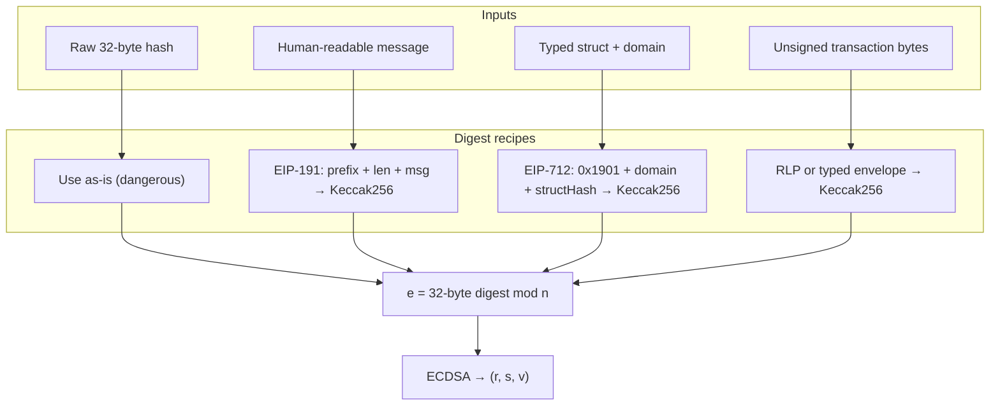
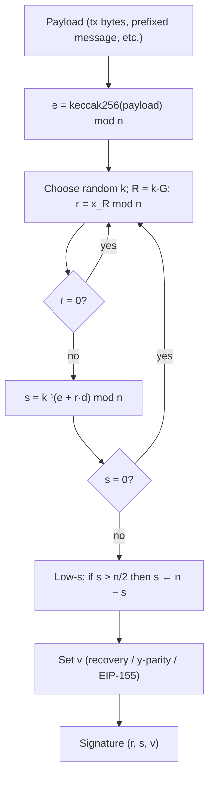
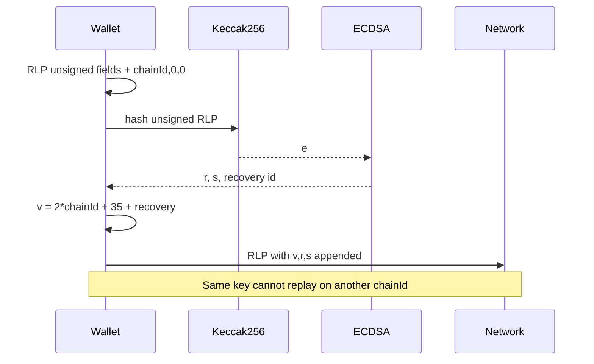
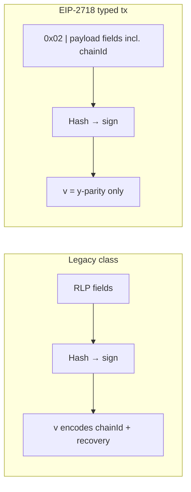
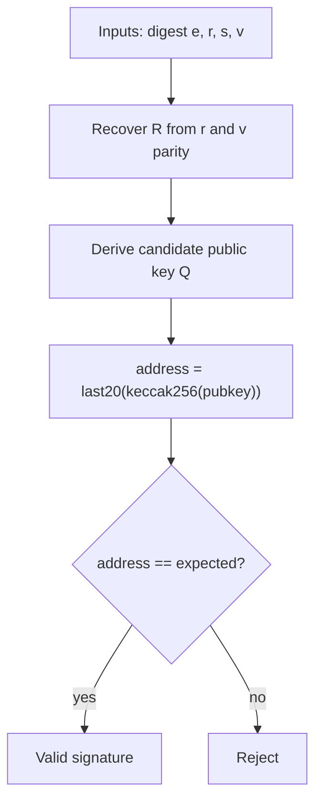

## Ethereum signing: an introduction

Ethereum signing is the cryptographic mechanism that allows users to prove ownership of an Ethereum address (and its associated funds or permissions) without revealing their private key. It is based on the **Elliptic Curve Digital Signature Algorithm (ECDSA)** using the **secp256k1** curve—the same curve used by Bitcoin. Every transaction you send on-chain and every off-chain message you sign (for example logging into a dApp or approving a permit) is cryptographically signed. This provides three key security properties:

- **Authenticity**: Only the private-key holder could have created the signature.
- **Integrity**: The signed data cannot be altered without invalidating the signature.
- **Non-repudiation**: The signer cannot later deny having authorized the action.

Without signing, Ethereum would have no way to know who authorized a transfer, a smart-contract call, or a login.

---

## What is being signed?

A signature always binds to **exactly one** 32-byte value *h* (sometimes called the signing hash or digest). What differs between flows is **how *h* is derived**:

| Flow | Digest construction | Typical use |
|------|---------------------|-------------|
| **Raw / dangerous** | Caller supplies arbitrary 32-byte hash | Rare; most apps avoid this for humans |
| **EIP-191** personal message | `\x19Ethereum Signed Message:\n` + len(msg) + UTF-8 message, then Keccak256 | `personal_sign`, login challenges |
| **EIP-712** typed data | Domain separator + struct hash per typed schema, combined per spec, then Keccak256 | Permits, structured intents, human-readable fields in wallets |
| **Type‑N transaction** | Canonical RLP or typed tx encoding for that tx type, then Keccak256 | Transfers, contract calls, deployment |

If two different messages produce the same *h* (collision or misuse), signatures are interchangeable—so **domain separation** (chain ID in txs, EIP-712 domain in typed data, EIP-191 prefix for text) is essential.

The diagram below shows how **four different intents** all collapse to **one 32-byte digest** *e* (or *h*) before ECDSA runs.

---

## 1. Cryptographic primitives

### The secp256k1 elliptic curve

Ethereum’s ECDSA operates over the **secp256k1** curve defined by:

$$
y^2 = x^3 + 7 \pmod{p}
$$

where:

- $p = 2^{256} - 2^{32} - 977$ (a very large prime),
- The curve order $n$ (number of points in the subgroup generated by $G$) is also a large prime,
- $G$ is the fixed generator point (base point).

A **private key** $d$ is a random integer with $1 < d < n$ (usually 256 bits). The **public key** $Q$ is computed as:

$$
Q = d \cdot G
$$

(elliptic-curve scalar multiplication). The public key is 64 bytes (uncompressed *x* and *y*, excluding a format prefix) or 33 bytes (compressed).

### Ethereum address derivation

From the public key:

1. Take the uncompressed public key (excluding the `0x04` prefix) → 64 bytes (*x* ∥ *y*).
2. Compute `keccak256(pubkey)` (Keccak-256 as used by Ethereum—not NIST SHA-3).
3. Take the last 20 bytes → your `0x…` address.

---

## 2. ECDSA signing algorithm

To sign any data (a transaction or a message), a standards-compliant signer follows these steps:

1. **Hash the payload** to obtain a 256-bit integer $e$:

   $$
   e = \text{keccak256}(\text{payload}) \bmod n
   $$

2. **Generate a random ephemeral key** $k$ (the nonce). $k$ **must** be cryptographically random and **never reused**—reusing it leaks the private key.

3. Compute the point $R = k \cdot G = (x_R, y_R)$.

4. Let $r = x_R \bmod n$. If $r = 0$, pick a new $k$ and retry.

5. Compute the signature component $s$:

   $$
   s = k^{-1} \cdot (e + r \cdot d) \pmod{n}
   $$

   where $k^{-1}$ is the modular inverse of $k$ modulo $n$. If $s = 0$, retry.

6. **Low-*s* normalization** (Ethereum standard, EIP-2): If $s > n/2$, set $s \leftarrow n - s$. This reduces **signature malleability** (two valid signatures for the same message).

7. **Recovery identifier** $v$: A small value that lets verifiers recover the public key from the pair $ (r,s) $ alone (see [Signature verification and public-key recovery](#5-signature-verification-and-public-key-recovery)). For legacy transaction contexts it often incorporates chain ID (post-EIP-155); for typed transactions it is typically the **y-parity** (0 or 1).

The final **signature** is the triplet **(r, s, v)**.

The flowchart below matches this sequence end-to-end.

---

## 3. Transaction signing (on-chain)

### Legacy transactions and EIP-155 (replay protection)

Before signing:

1. **RLP-encode** the transaction fields. After EIP-155, the **unsigned** form includes chain ID and two zero placeholders:

   - Pre-EIP-155: `RLP([nonce, gasPrice, gasLimit, to, value, data])`
   - Post-EIP-155: `RLP([nonce, gasPrice, gasLimit, to, value, data, chainId, 0, 0])`

2. Compute the Keccak-256 hash of that RLP payload → $e$.

3. Run the ECDSA steps on $e$ to obtain $ (r,s) $ and recovery bit $r_{\text{ec}} \in \{0,1\}$.

4. The **broadcast** `v` for legacy txs becomes (EIP-155):

   $$
   v = \text{chainId} \times 2 + 35 + r_{\text{ec}}
   $$

   (or $+36$ for the other recovery case). This ties the signature to a **specific chain**, preventing replay on Ethereum Classic, testnets, or other networks with the same key.

The signed transaction that is broadcast is:

`RLP([nonce, gasPrice, gasLimit, to, value, data, v, r, s])`.

### Modern typed transactions (EIP-2718, EIP-1559, EIP-2930, EIP-4844)

- Transactions are prefixed with a **transaction type** byte (for example `0x02` for EIP-1559).
- The **payload** that is hashed and signed is defined by that EIP’s canonical encoding; ECDSA math is unchanged.
- **`v`** in the serialized tx is the **y-parity** (0 or 1) because **chain ID** and other domain fields already appear **inside** the typed payload—unlike legacy EIP-155, where `v` encoded chain ID.

---

## 4. Off-chain message signing

Ethereum also supports signing arbitrary messages (for example “Sign in with Ethereum”, token permits, off-chain votes).

### EIP-191 (`personal_sign`)

The payload that actually gets signed is **not** the raw message. Wallets concatenate:

`0x19` ∥ `Ethereum Signed Message:\n` ∥ **length of message** (per client encoding) ∥ **message bytes**

Then:

$$
e = \text{keccak256}(\text{prefix})
$$

Exact length encoding follows your client library; the important part is the **domain-separating prefix** so the same key cannot be tricked into signing a transaction-shaped blob as “just a message.”

This prefix stops a malicious dApp from tricking a wallet into signing bytes that are also a valid transaction encoding.

### EIP-712 (typed structured data)

For structured data (for example “Approve spending 100 USDC”), EIP-712 defines types, a **domain separator** (`name`, `version`, `chainId`, `verifyingContract`, …), and a **struct hash**. The digest is:

$$
e = \text{keccak256}\bigl(\texttt{0x1901} \,\Vert\, \text{domainSeparator} \,\Vert\, \text{structHash}\bigr)
$$

The three parts are **concatenated as bytes** before hashing; see [EIP-712](https://eips.ethereum.org/EIPS/eip-712) for domain and struct hashing rules.

Wallets can show **human-readable** fields (“You are signing: Approve 100 USDC to 0x…”), which is much safer than signing opaque hex.

---

## 5. Signature verification and public-key recovery

Ethereum (and Solidity) use the **`ecrecover`** precompile at address `0x01`. Given `(hash, r, s, v)` it:

1. Uses the recovery information in `v` to reconstruct the candidate point $R$ on the curve from $r$ (there are two possible $y$ coordinates; parity disambiguates).
2. Algebraically derives a candidate public key $Q$ from the ECDSA equation.
3. Hashes the public key and takes the last 20 bytes to form an address, then checks it against the expected signer.

This is why you often transmit only **(r, s, v)**—no public key needs to accompany every signature.

---

## 6. Security best practices and gotchas

- **Never reuse the nonce $k$**. Production libraries often use **deterministic ECDSA** (RFC 6979) to derive $k$ from the key and message.
- **Low-*s*** normalization is expected by the network and wallets (EIP-2).
- **Chain ID** must be part of the signed material (EIP-155 for legacy; explicit in typed txs) to stop **cross-chain replay**.
- **Avoid `eth_sign`** on arbitrary raw hashes for users—it is dangerous and largely deprecated for human-facing flows.
- Prefer **EIP-712** for structured, user-visible signing when possible.

---

## 7. In practice (libraries)

- **ethers.js**, **viem**, **web3.js**: `signTransaction`, `signMessage`, typed data helpers for EIP-712.
- **eth-account** (Python): `Account.sign_transaction()`, `Account.sign_message()`, `sign_typed_data`.
- **Solidity**: `ecrecover(hash, v, r, s)` or OpenZeppelin’s `ECDSA` library (with **EIP-2098** compact signatures where applicable).

Wallets and nodes standardize **low-*s*** and encoding rules. **Never** implement ECDSA from scratch in production; use audited libraries and hardware when possible.

---

## Verifying signatures in practice (Foundry and the ecosystem)

**Foundry** ([`foundry-rs/foundry`](https://github.com/foundry-rs/foundry)) is one of the **most widely used** open-source toolkits for EVM smart-contract work—**Forge** for tests and fuzzing, **Cast** for RPC and encoding helpers, **Anvil** for local chains. Protocol engineers and auditors often reproduce signature issues in **Forge** tests that call `ecrecover` or OpenZeppelin `ECDSA` helpers.

For a **step-by-step** walkthrough of **verifying an Ethereum signature** in that toolchain, see Bogacan Yigitbasi’s article **[Verify signature on Ethereum using Foundry](https://medium.com/@bogachanyigitbasi/verify-signature-on-ethereum-using-foundry-454341cf80a2)** on Medium. It helps debug “valid in the wallet but reverts on-chain” cases (wrong digest, wrong `v`, EIP-191 vs raw hash, etc.).

Third-party articles reflect the author’s tool versions at publish time; cross-check with current Foundry and Solidity docs for your pinned versions.

---

## Lifecycle: typed message or permit (off-chain sign → on-chain consume)

Common for **Permit**, **meta-transactions**, and **governance** votes.

1. **Intent**: Application builds a **struct** and an **EIP-712** domain.
2. **Display**: Wallet shows decoded fields; user or agent approves.
3. **Hash**: Wallet computes the EIP-712 digest *h* and signs → (*v*, *r*, *s*).
4. **Relay**: Signed payload goes to a relayer, API, or contract.
5. **Verify and effect**: Contract checks signature, nonce/deadline, replays, then updates state.

**Summary:** encode intent → sign digest → verifier checks signature and policy → state change.

---

## Lifecycle: type-2 transaction (EIP-1559)

1. **Build fields**: `chainId`, nonce, `maxFeePerGas`, `maxPriorityFeePerGas`, `gas`, `to`, `value`, `data`, access list (if any).
2. **Serialize**: Typed transaction envelope for that tx type per consensus rules.
3. **Hash**: Keccak256(serialized unsigned tx) → *h*.
4. **Sign**: EOA signs *h* → signature bytes appended to form the **signed** transaction.
5. **Broadcast**: Mempool / builder / RPC; fee market is separate from signing correctness.
6. **Inclusion**: Block producer includes tx; receipt exposes success/failure and logs.

**Replay note:** Legacy-class txs use EIP-155 in `v`; typed txs carry `chainId` in the payload. Signing for the wrong chain yields a transaction invalid on the target network.

---

## Where smart accounts change the story

**ERC-4337** and **ERC-1271** flows may not use a simple `ecrecover` on an EOA digest: validation can run **custom logic** (modules, paymasters, session keys). The high-level lifecycle (intent → authorization artifact → verify → execute) is the same, but **what bytes are signed** and **who verifies** differ; follow the account’s documented validation path.

---

## Operational checklist for agents and backends

- Pin **chainId** and **verifying contract** in EIP-712 domains; never accept ambiguous domains from untrusted peers.
- Enforce **deadlines**, **nonces**, and **allowlists** server- and contract-side; signatures are not a substitute for policy.
- Treat **signing** as a **high-risk** operation: separate build/hash (audited code) from key custody (HSM, OS store, policy engine).
- Log **what** was shown to the user (for EIP-712, the typed message) for audit—not only the raw hex.

---

## See also

- [Signing overview](/signing) — EVM in context of other ecosystems
- [Verify signature on Ethereum using Foundry](https://medium.com/@bogachanyigitbasi/verify-signature-on-ethereum-using-foundry-454341cf80a2) — hands-on Foundry walkthrough (Bogacan Yigitbasi, Medium)
- [Morpheum x402](/x402) — HTTP-native payments that may use EVM signatures in headers
- [Agent wallet](/agent-wallet) — wallet patterns for automated signers
