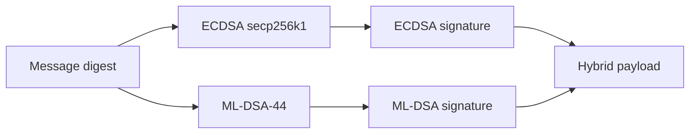
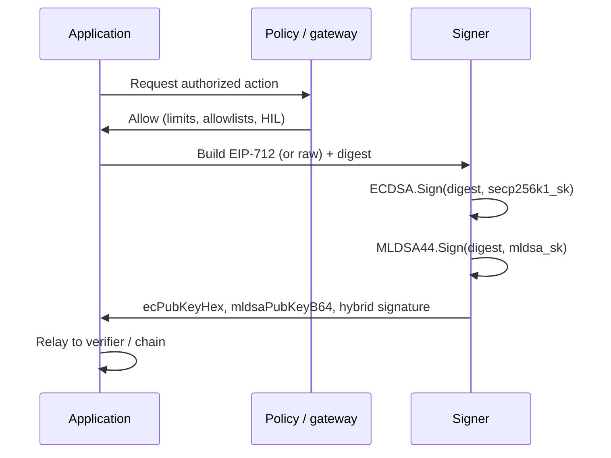
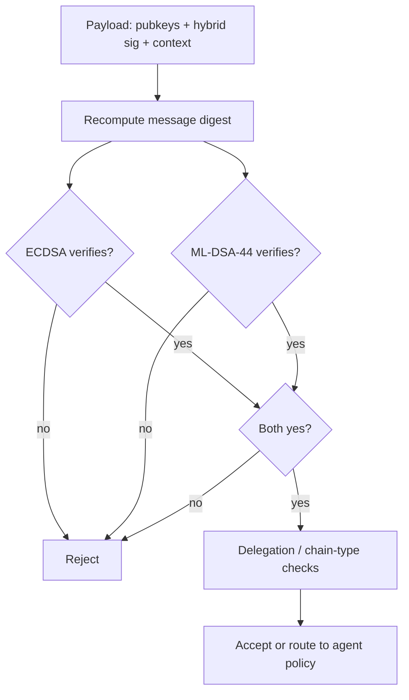
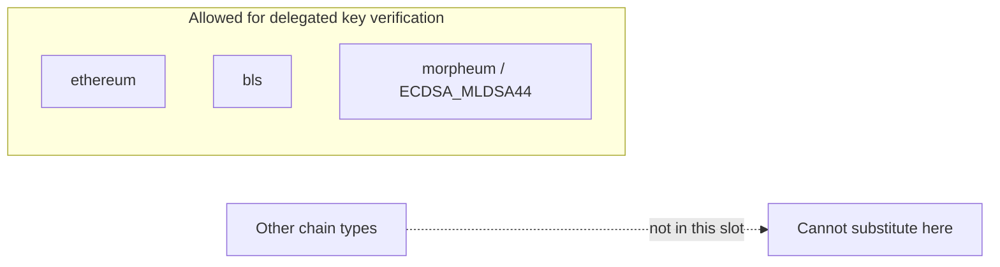

## Overview

**Yes — Morpheum has a unique, purpose-built hybrid signature scheme called `ECDSA_MLDSA44`.**  
It is the only signature type that is explicitly “Morpheum-native” and is designed to give you **both Ethereum-style compatibility today and post-quantum security for the future**.

Below is a technical breakdown aligned with the Morpheum standards implementation. **Wire formats, exact byte packing, and library versions** evolve with releases—confirm against the latest **API** and **wallet** documentation for your deployment.

---

## 1. What is ECDSA_MLDSA44?

It is a **hybrid signature** that concatenates two independent signatures over the same message:

| Component      | Algorithm                  | Purpose                                      | Size (typical) |
|----------------|----------------------------|----------------------------------------------|----------------|
| **ECDSA**      | ECDSA on secp256k1         | Backward compatibility, Ethereum-style recovery | 65 bytes (r+s+v) |
| **ML-DSA-44**  | NIST FIPS 204 (Dilithium2-class parameter set) | Post-quantum resistance                      | ~2,420 bytes (compressed) |

The final signature is the **concatenation** (or structured packing) of both parts, often described as:

```
"<hybrid ECDSA||ML-DSA-44>"
```

This is **not** a single mathematical construct like a Schnorr aggregate; it is two completely separate signatures that are verified **independently**.

---

## 2. Why does Morpheum use this hybrid?

- **Ethereum compatibility** — The ECDSA part allows existing tooling, wallets, and verifiers (Ecrecover, etc.) to continue working.
- **Quantum resistance** — The ML-DSA-44 part protects against future quantum attacks on the discrete-log problem.
- **On-chain verification of delegated keys** — Only three chain types are allowed for on-chain delegated key verification: `ethereum`, `bls`, and `morpheum`. ECDSA_MLDSA44 is the Morpheum slot.

The diagram below shows how one logical **message digest** fans out into two parallel signature paths (classical vs post-quantum), then merges into a single hybrid artifact:



---

## 3. Address format (Morpheum-specific)

- **ChainType**: `ChainTypeMorpheum`
- **Address format**: Bech32m, prefix **`mr4m1…`** (or similar `mr4m` variant)
- Example: `mr4m1q9…` (42–90 characters typical)

The `types.Address` implementation supports:

- Automatic inference from the `mr4m` prefix
- Full validation via `clitool/validation.ValidateAddressByChain`
- Conversion helpers and JSON marshalling consistent with other chains

---

## 4. Signing flow (how a signer produces the signature)

When a signer uses a Morpheum key pair:

1. The private key material actually contains **two** keys:
   - ECDSA secp256k1 private key
   - ML-DSA-44 private key

2. The message is prepared as a normal EIP-712 typed-data payload (or raw payload for some flows).

3. Two signatures are generated:
   - `ECDSA_sig = ECDSA.Sign(message_digest, secp256k1_sk)`
   - `MLDSA_sig = ML_DSA_44.Sign(message_digest, mldsa_sk)`

4. The two signatures (plus the public keys) are packaged together.

5. The final payload that is sent usually contains:
   - `ecPubKeyHex` — the ECDSA public key (0x04… uncompressed)
   - `mldsaPubKeyB64` — the ML-DSA-44 public key (base64)
   - `signature` — the concatenated hybrid signature

This matches wallet-creation and agent-delegation examples in the standards tooling.

**End-to-end signing lifecycle** (policy and gateways still gate *when* keys are used):



---

## 5. Verification flow (how the chain / verifier checks it)

The `UniversalSignatureVerifier` routes `SigType == ECDSA_MLDSA44` to the dedicated verifier (for example an `ecdsamldsa44_verifier` pattern).

Typical verification steps:

1. **Extract public keys** from the payload:
   - `ecPubKey` from `ecPubKeyHex`
   - `mldsaPubKey` from `mldsaPubKeyB64`

2. **Compute the same message digest** the signer used (standard EIP-712 hash or the algorithm-specific hash for this SigType).

3. **Verify both parts independently**:
   - ECDSA part: `crypto.VerifySignature` or `Ecrecover` (recoverable)
   - ML-DSA-44 part: `mldsa.Verify(pubKey, message, sig)`

4. **Both must succeed** for the whole signature to be considered valid.

5. **Agent-delegation / owner check**:
   - If the recovered signer ≠ owner → fall through to `IsAgentApprovedForChain(owner, agent, action, "morpheum")`
   - Chain-type validation is enforced (a delegation for `ethereum` cannot be used on `morpheum`).

**Dual verification** (both gates must open):



**Delegation routing** (only three chain types for on-chain delegated key verification):



---

## 6. Where ECDSA_MLDSA44 is used in the system

| Context                        | How it is used                                                                 |
|--------------------------------|--------------------------------------------------------------------------------|
| **Agent delegation**           | Owner can approve an agent using any SigType; on-chain verification of the agent’s generated keys is only allowed for `ethereum` / `bls` / `morpheum` |
| **Multi-sign wallet creation** | Deploy and setup operations can be signed with `ECDSA_MLDSA44` (payload includes the two pubkeys) |
| **On-chain verification**      | Only these three chain types are allowed for delegated key-pair verification   |
| **Universal verifier**         | Routed automatically by `SigType` in `UniversalSignatureVerifier`              |
| **types.Address**              | Full support (`ChainTypeMorpheum`, `mr4m` inference, validation caching, etc.) |

---

## 7. ML-DSA-44 specification (NIST FIPS 204)

**ML-DSA** (Module Lattice Digital Signature Algorithm) is the algorithm family standardized in **[NIST FIPS 204](https://csrc.nist.gov/publications/detail/fips/204/final)** (August 2024). It is the official name for what the **CRYSTALS-Dilithium** submission became after standardization. **ML-DSA-44** is one of three approved parameter sets; it is the **smaller / faster** option and is often described as the successor to the former “Dilithium2” profile in pre-standard literature.

| Topic | Detail |
| --- | --- |
| **Hardness assumption** | Structured lattice problems over **module lattices** (Module-LWE / Module-SIS style assumptions), not elliptic-curve discrete log. |
| **Security category** | **NIST Level 2** (ML-DSA-44)—intended to align with AES-128-ish classical security in NIST’s categorization; see FIPS 204 tables for exact claims. |
| **Keys and signatures** | Public key, secret key, and signature sizes are **fixed** per parameter set; signatures and keys are **larger** than ECDSA—hence the hybrid: keep ECDSA for ecosystem fit, add ML-DSA for long-term quantum resistance. |
| **API shape** | **Sign(sk, message)** → signature; **Verify(pk, message, signature)** → accept/reject. The message is typically a **digest** (e.g. 32-byte hash) in integrated protocols—match what your Morpheum deployment specifies. |
| **Hybrid note** | In **ECDSA_MLDSA44**, ML-DSA signs the **same** digest as ECDSA (or the same logical message per spec); there is no single fused signature—verifiers run **two** checks. |

For background on **why** lattice PQC matters next to ECDSA in Web3, see [Quantum threat to signatures](/signing/quantum-threat).

---

## 8. Summary

A Morpheum signer holds two private keys (secp256k1 + ML-DSA-44). It signs the **same** EIP-712 digest with **both** algorithms, packs the two signatures and the two public keys into a single hybrid payload, and sends it. The verifier recomputes the digest, verifies the ECDSA part (for compatibility and recovery) **and** the ML-DSA-44 part (for quantum resistance), and only accepts the signature if **both** checks pass. Chain-type validation then decides whether this signature can be used for agent delegation or on-chain operations.

---

## Layers: chain crypto vs Morpheum orchestration

| Layer | Responsibility | Examples |
|-------|----------------|----------|
| **Chain / protocol** | Digest definition, verification on-network | EIP-712 hash, hybrid ECDSA + ML-DSA checks |
| **Application / standard** | Payload shape verifiable by counterparties | Agent delegation, wallet creation payloads |
| **Morpheum stack** | Policy, identity, logging, gateway, agent execution | Allowlists, spend caps, MCP invocation |

A **valid** signature on the wrong **network**, **domain**, or **policy** should still **fail closed** at the Morpheum or application layer even if the bytes are mathematically correct.

---

## Related product flows

- **x402** and **HTTP-native** authorization still depend on the **scheme** and **network**; see [Morpheum x402](/x402) and [Ethereum (EVM) signatures](/signing/ethereum-signature) when payloads are EVM-style.
- **Agent wallets** and custody: [Agent wallet](/agent-wallet), [MWVM](/mwvm).

---

## See also

- [Signing overview](/signing) — EVM, Solana, Bitcoin, Morpheum at a glance
- [Ethereum (EVM) signatures](/signing/ethereum-signature) — EIP-712 and ECDSA context for the classical half
- [Quantum threat to signatures](/signing/quantum-threat) — PQC planning and hybrid transitions
- [Morpheum x402](/x402) — HTTP 402 flows and payment headers
- [MCP](/mcp) — surfaces that may invoke paid or signed actions
