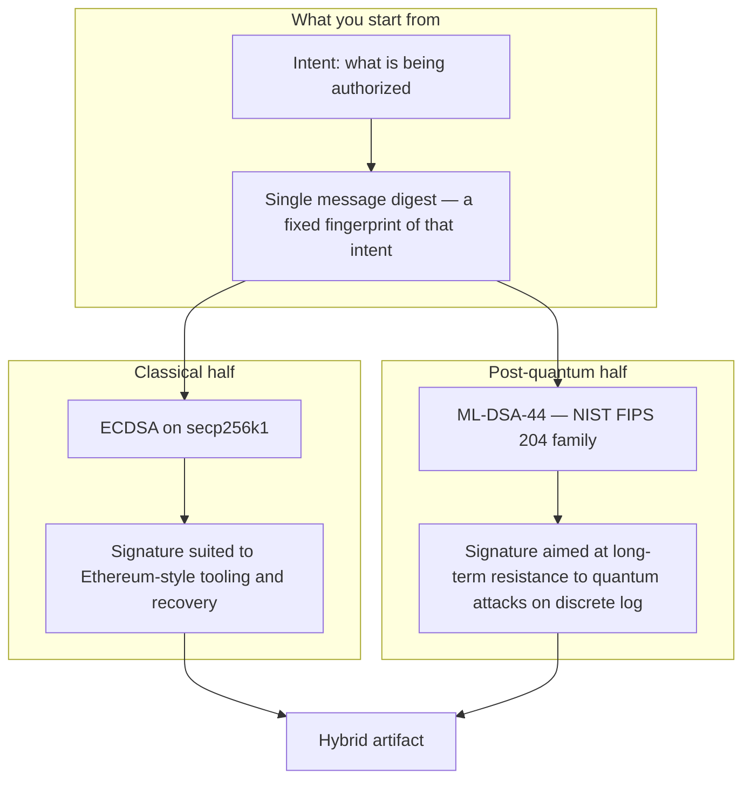
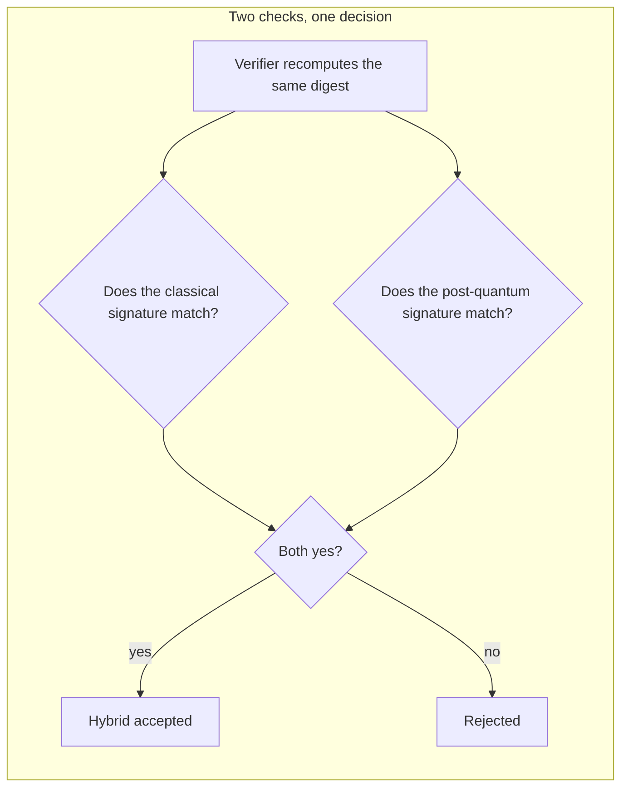
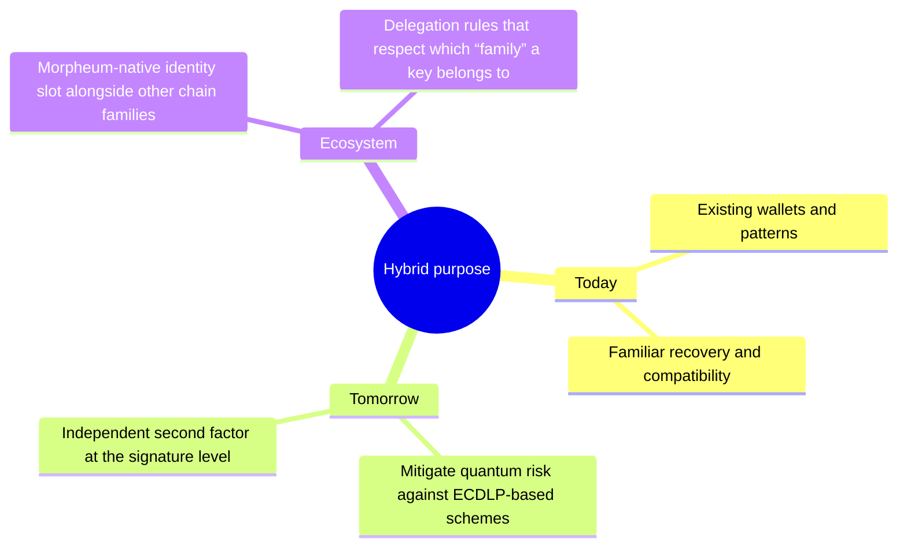
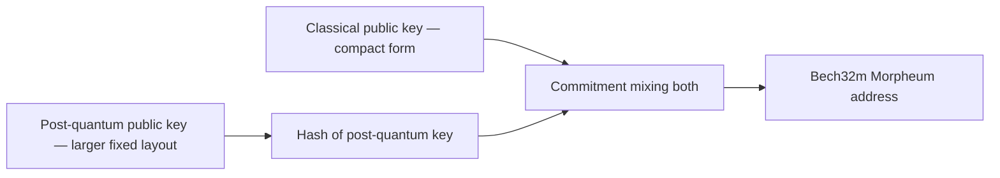
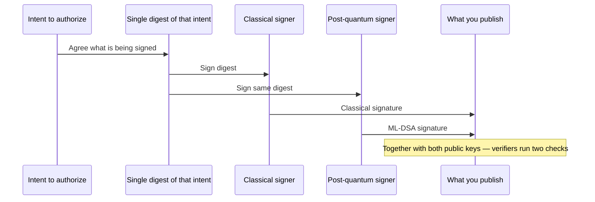
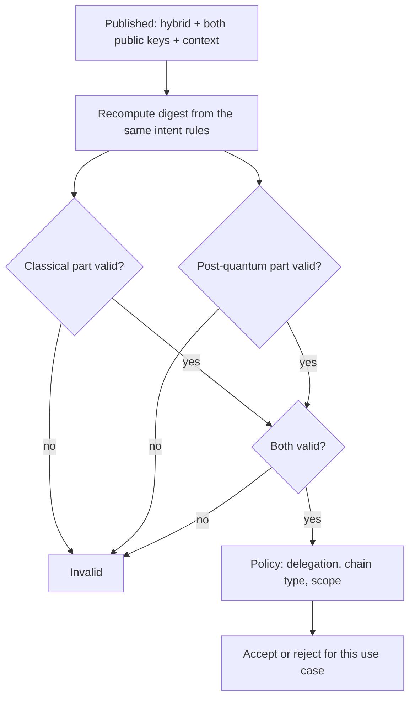
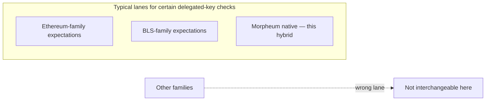
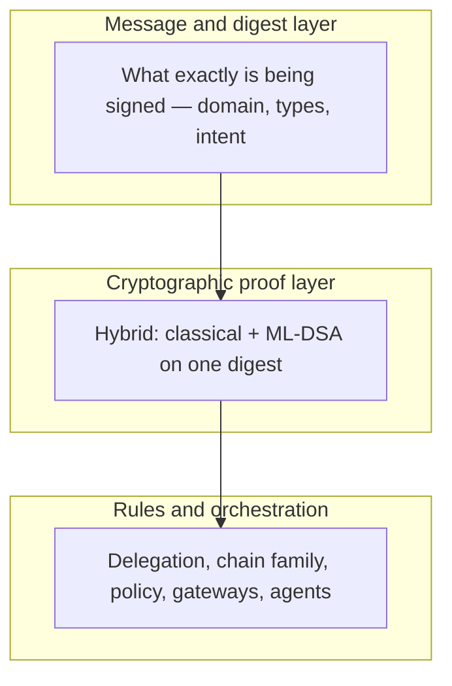

## Overview

Morpheum defines a **hybrid signature** built for two goals at once: **stay compatible with today’s Ethereum-style ecosystem**, and **add a post-quantum layer** so identities and authorizations remain meaningful as cryptography evolves.

This page explains **how to read the idea**—what the two halves do, how they combine, and what verifiers check. Exact wire layouts and deployment details change over time; treat this as the **conceptual map**, not a byte-level specification.

---

## What is the hybrid?

**ECDSA_MLDSA44** is not one exotic math object. It is **two ordinary signatures**, both computed over the **same logical content** (the same fixed-size digest of what you intend to sign), then carried together as **one hybrid artifact**.

The classical piece is **small and familiar** to existing wallets and verifiers. The ML-DSA piece is **much larger**—that tradeoff is deliberate: you keep interoperability while adding a second, independent check rooted in **lattice assumptions** instead of elliptic-curve discrete log.

This is **not** a fused or aggregated signature like some multi-party schemes. Each algorithm could be described on its own; the hybrid simply **requires both to succeed**.

---

## Why combine classical and post-quantum?

**Ethereum-oriented compatibility** — The ECDSA half lets familiar workflows (including recovery-style reasoning where applicable) remain part of the story.

**Quantum awareness** — Shor-class attacks threaten discrete-log cryptography; ML-DSA adds a **separate** security story based on structured lattices, standardized as **ML-DSA** under **NIST FIPS 204**.

**Identity and delegation context** — In Morpheum’s world, **only certain signature families** are treated as valid for particular on-chain or policy checks. Morpheum’s native scheme occupies its own lane alongside other recognized families—so **you cannot substitute** one family’s delegation for another’s when the rules say “this lane only.”

---

## Morpheum addresses

A Morpheum address is a **short, human-readable string** (Bech32m-style) that encodes a commitment derived from **both** public keys: the **compressed** classical key material and a **hash** of the post-quantum public material. Prefixes such as **`mr4m`** (with witness-style segments like **`mr4m1…`**) identify this family at a glance.

Conceptually:

Length varies with encoding, but the **idea** is: one address **binds** the two keys that the hybrid signature will later prove control of.

---

## How signing works (conceptually)

The signer holds **two private keys**—one for secp256k1, one for ML-DSA-44. For a given authorization:

1. The **intent** is reduced to **one digest** (for many apps this is the hash of a **typed structured message** in the Ethereum sense—same conceptual role as “what is uniquely being signed”).
2. That **same digest** is fed to **both** signing processes.
3. The **hybrid output** carries the classical signature, the post-quantum signature, and is accompanied by **both public keys** so anyone can verify without guessing keys.

Policy, gateways, and human-in-the-loop rules still decide **whether** signing is allowed—cryptography only proves **who agreed** to the digest, not whether the action was wise or permitted by policy.

---

## How verification works (conceptually)

A verifier **never** treats the hybrid as a single opaque magic string. They:

1. **Obtain both public keys** from the published material.
2. **Recompute the digest** using the **same rules** the signer used (same intent, same domain, same serialization of the message).
3. **Check the classical signature** against the digest and the classical public key.
4. **Check the ML-DSA signature** against the digest and the post-quantum public key.
5. **Accept only if both succeed**—then apply **policy**: owner vs agent, chain family, delegation scope, and so on.

Delegation logic is **orthogonal** to the math: even a valid hybrid must still match **who may act** and **for which chain family** the approval was granted.

---

## ML-DSA-44 in one glance

**ML-DSA** (Module Lattice Digital Signature Algorithm) is the name standardized in **[NIST FIPS 204](https://csrc.nist.gov/publications/detail/fips/204/final)** for what grew out of **CRYSTALS-Dilithium**. **ML-DSA-44** is the **smaller, faster** approved parameter set—often discussed as the successor to older “Dilithium2”-scale profiles in pre-standard writing.

| Idea | Plain language |
| --- | --- |
| **What it rests on** | Hard problems on **module lattices**, not ECDLP. |
| **Rough strength band** | **NIST Level 2** category for this parameter set—see FIPS 204 for precise statements. |
| **Why it is bulky** | Keys and signatures are **much larger** than ECDSA; the hybrid keeps the small classical surface while adding PQ assurance. |
| **In this hybrid** | Same digest as the classical half; **two** verification outcomes must both be true—there is still **no** single merged signature equation. |

For **why** lattice-based signatures matter beside ECDSA in Web3 timelines, see [Quantum threat to signatures](/signing/quantum-threat).

---

## Where this mental model lands in the stack

A signature can be **cryptographically valid** yet **correctly rejected** if the **network**, **domain**, or **policy** does not match—**fail closed** is the right mental default.

---

## Related reading

- [Signing overview](/signing) — how Morpheum sits beside EVM, Solana, and Bitcoin
- [Ethereum (EVM) signatures](/signing/ethereum-signature) — typed messages and the classical half
- [Quantum threat to signatures](/signing/quantum-threat) — PQC context
- [Morpheum x402](/x402) — HTTP-native flows where scheme and network still matter
- [Agent wallet](/agent-wallet) and [MWVM](/mwvm) — custody and execution context

---

## See also

- [MCP](/mcp) — surfaces that may trigger paid or signed actions
