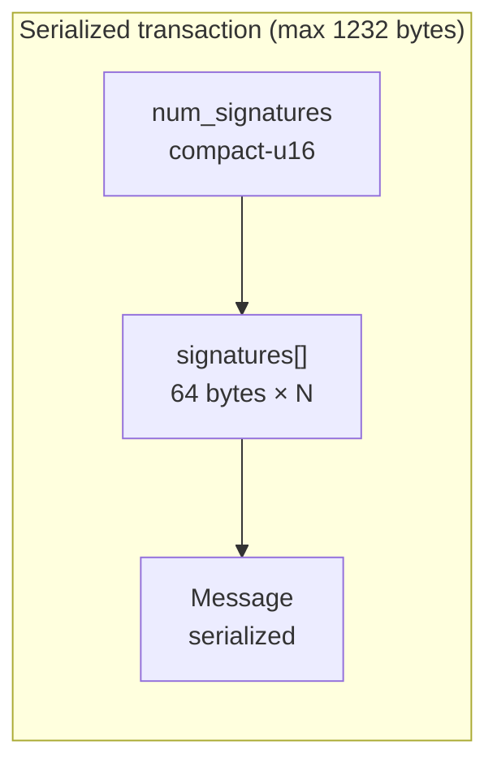
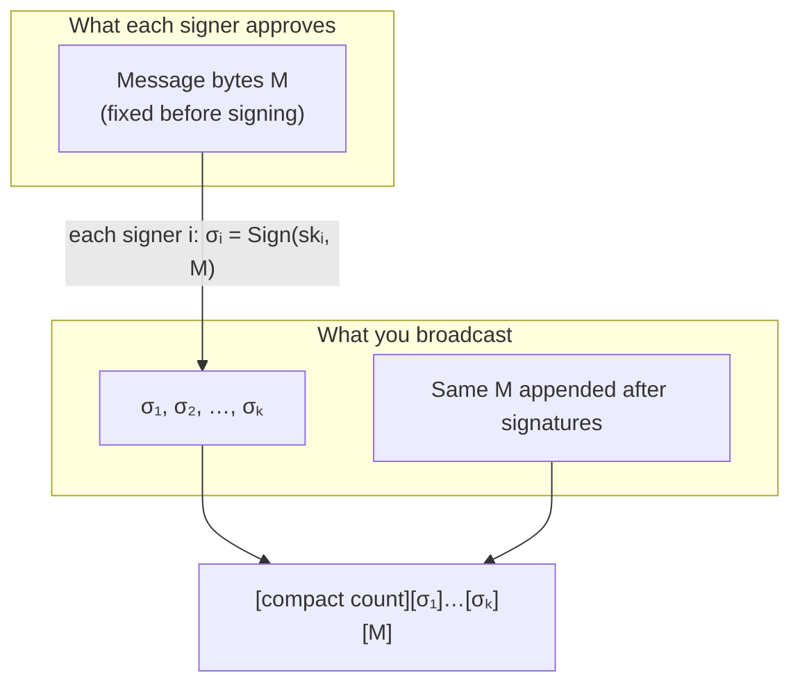
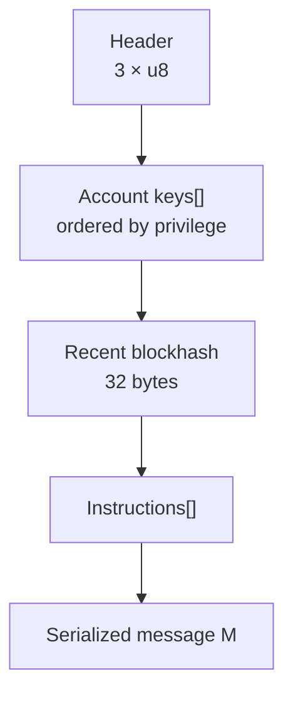
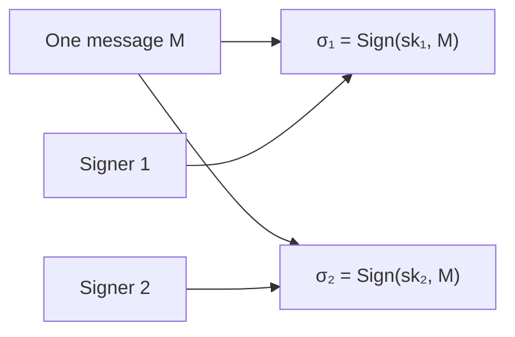
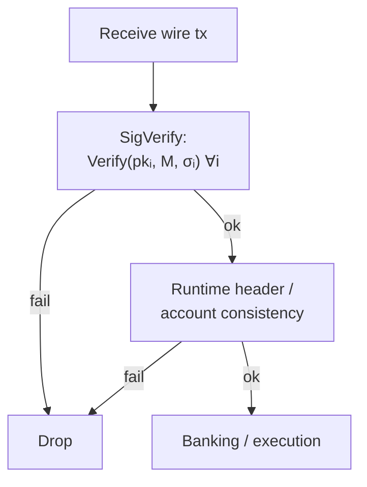
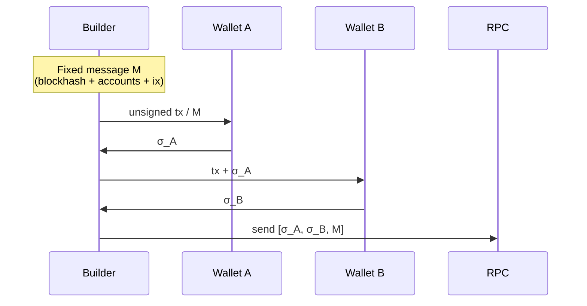

## Solana signing: introduction

Solana is a high-performance blockchain that relies on **cryptographic digital signatures** to authorize transactions. Signing proves that the holder of a private key explicitly approves the transaction’s actions. Without valid signatures, the network rejects the transaction.

Solana uses the **Ed25519** signature scheme (an **EdDSA** construction on a twisted Edwards curve, standardized in RFC 8032). It is fast, secure, and compact:

| Artifact | Size |
|----------|------|
| **Public key** (account address) | 32 bytes |
| **Private key** (secret scalar / seed handling is implementation-defined) | 32 bytes |
| **Signature** | 64 bytes |

Ed25519 provides strong unforgeability assumptions and is optimized for speed, which aligns with Solana’s goal of processing many transactions per second.

### Ed25519 in one mathematical picture (high level)

Ed25519 signs a **message** $M$ (here, the serialized transaction **Message** bytes). Write $sk$ for a private key and $pk$ for the matching public key. The signer produces a 64-byte signature $\sigma$; verifiers run a deterministic check:

$$
\sigma = \mathrm{Sign}_{\mathrm{Ed25519}}(sk, M), \qquad \mathrm{Verify}_{\mathrm{Ed25519}}(pk, M, \sigma) \in \{\mathrm{true}, \mathrm{false}\}.
$$

Internally, Ed25519 operates on the **twisted Edwards curve** **Curve25519** in Edwards form over a prime field $\mathbb{F}_p$ (with a specific cofactor-aware encoding). You do **not** need the curve equations to use Solana safely—**audited SDKs** implement RFC 8032—but the usual Edwards shape is:

$$
-x^2 + y^2 = 1 + d\, x^2 y^2 \pmod p
$$

for fixed curve parameters $(p, d)$. Scalar multiplication and hashing inside **Sign** / **Verify** are defined by the standard; **never** reimplement them in application code.

---

## 1. Keypairs and accounts

Every Solana account that can sign transactions is controlled by an **Ed25519 keypair**:

- The **public key** *is* the account address (often **base58**-encoded, e.g. `7EcDhS…`).
- The **private key** is used only for signing — never shared.
- Accounts **without** a private key (**Program Derived Addresses**, PDAs) cannot sign directly; they are controlled by programs via seeds and CPI rules.

Keypair generation follows standard libraries (e.g. `@solana/web3.js` in JavaScript or `solana-sdk` in Rust); the wire format uses the raw 32-byte keys as in the protocol.

---

## 2. Transaction structure

A Solana transaction is **not** signed as an opaque whole. It has two main parts:

1. An array of **signatures** (64 bytes each, Ed25519).
2. A **Message** — the payload that signers actually approve.

### Wire layout (conceptual)



**Serialized transaction format** (compact binary on the wire):

- `num_signatures` (**compact-u16**) — number of signatures.
- `signatures` — array of **64-byte** Ed25519 signatures (order must match signer order in the message).
- `Message` — **header** + **account keys** + **recent blockhash** + **instructions** (+ versioned extras as applicable).

The **total serialized size** is capped at **1232 bytes** (MTU-friendly).

### Why “message first, signatures in front” is easy to get wrong



Every required signer signs the **same** $M$. The signature vector is **prepended** to the serialized message for broadcast; verification recomputes checks over $M$, not over the signatures.

---

## 3. The Message (what gets signed)

The **Message** is serialized to bytes $M$ and signed. It contains everything the cluster needs to enforce permissions and execute programs:

| Field | Size | Role |
|-------|------|------|
| **Header** | 3 bytes | `num_required_signatures` (u8), `num_readonly_signed_accounts` (u8), `num_readonly_unsigned_accounts` (u8) |
| **Account keys** | variable | Compact list of **32-byte** public keys, in a **fixed order** (signer+writable → signer+readonly → non-signer+writable → non-signer+readonly) |
| **Recent blockhash** | 32 bytes | Binds the tx to a short-lived fork context; mitigates replay within the validity window (~150 slots is a common rule of thumb, **not** a substitute for reading current RPC/cluster policy) |
| **Instructions** | variable | Compiled instructions: program id index, account indices, opaque data |

Header + ordering let the runtime infer **who must sign**, **who may write**, and **who is readonly** without extra per-account flags in the instruction body.

### Message composition (ordering matters)



---

## 4. How signing works (step-by-step)

1. **Build the unsigned Message**  
   Create instructions (e.g. transfer SOL, invoke a program), collect all accounts, attach a **recent blockhash** from RPC, then serialize to bytes $M$.

2. **Identify signers**  
   Any account marked **signer** (including the **fee payer**) must supply a signature. The **fee payer** is the **first** account in `account_keys` and typically signs first in the signature list.

3. **Sign**  
   For each signer $i$ in **account key order** among signers, compute:

   $$
   \sigma_i = \mathrm{Sign}_{\mathrm{Ed25519}}(sk_i, M).
   $$

   Pseudocode:

   ```
   signature = ed25519_sign(private_key, serialized_message_bytes)
   ```

4. **Assemble**  
   Prepend the signature array (fee payer first, then other signers in the order required by the message). Full wire transaction: **signatures + serialized Message**.

5. **Submit**  
   Send to an RPC (e.g. `sendTransaction`); the leader may include it in a block.

**Important:** Solana supports **multiple signers** on one transaction natively. Each signer signs the **same** $M$. An account that appears in several instructions still contributes **one** signature for that transaction. (Contrast with common EVM mental models where one ECDSA signature often corresponds to one outer transaction from one EOA—Solana’s unit is “one message $M$, many $\sigma_i$”.)

### Multi-signer vs single-message



---

## 5. How verification works (network side)

When a validator receives the transaction:

1. **Signature verification (SigVerify)**  
   For each signature slot $i$, take the public key $pk_i$ from the ordered account list and check:

   $$
   \mathrm{Verify}_{\mathrm{Ed25519}}(pk_i, M, \sigma_i) = \mathrm{true}.
   $$

   Implementations batch and parallelize these checks; Ed25519 verification is fast.

2. **Runtime checks**  
   Enforce that the number of signatures matches `num_required_signatures`, and that writable / signer flags are consistent with the header. Invalid signature → drop **before** program execution.

3. **Execution**  
   Only if all checks pass does the transaction proceed to scheduling and **program** execution.



This ordering is why invalid signatures never burn **compute** in user programs: they fail cheaply at SigVerify.

---

## 6. Special cases and advanced topics

- **Partial signing** — Wallets can add one signature at a time (`partialSign`, pass-around flows). Same $M$, signatures accumulated until complete.



- **Versioned transactions (v0)** — **Address Lookup Tables (ALTs)** shrink on-chain address lists; **signing still binds to the resolved message** your SDK builds—always sign what your stack serializes.
- **Durable nonces** — Alternative to recent blockhash for long-lived or offline signing; semantics differ; use current docs for nonce accounts and danger zones.
- **Off-chain message signing** — Login / airdrops / proofs: arbitrary bytes with a **Solana-specific** domain separation; still Ed25519, **not** the same bytes as a transaction $M$.
- **Ed25519 program** — On-chain verification of **external** Ed25519 signatures via the built-in program is a **different** path from native transaction SigVerify.

---

## 7. Practical example (JavaScript-style pseudocode)

```js
const { Transaction, Keypair } = require('@solana/web3.js');

// 1. Create keypair
const signer = Keypair.generate();           // 32-byte pubkey + 32-byte secret material

// 2. Build transaction (unsigned Message inside)
let tx = new Transaction().add(/* instructions */);
tx.recentBlockhash = (await connection.getLatestBlockhash()).blockhash;
tx.feePayer = signer.publicKey;

// 3. Sign the Message
tx.sign(signer);                             // serializes M, then Ed25519-signs per signer

// 4. Send
await connection.sendRawTransaction(tx.serialize());
```

---

## Lifecycle and operations (agents / backends)

- **Blockhash freshness** — Retry with a new blockhash when RPC reports expiry or “blockhash not found”.
- **Account order and writable flags** — Must match program expectations; silent reordering invalidates signatures or instruction checks.
- **Fee payer vs authority** — Sponsorship separates who pays rent/fee from who authorizes program logic; govern with policy.
- **Simulation** — Signature validity does not imply program success; preflight when stakes are high.

---

## Summary

- **Signing** is **Ed25519** over the **serialized Message** $M$: $\sigma_i = \mathrm{Sign}(sk_i, M)$.
- The **Message** is the semantic commitment; **signatures** are proofs prepended on the wire.
- The design favors **fast parallel verification** and **multiple signers per transaction**, aligned with Solana’s execution model.

For **exact byte layouts**, **v0** rules, and **durable nonce** mechanics, follow current [Solana core documentation](https://solana.com/docs/core/transactions) and your SDK release notes. Prefer official SDKs (`@solana/web3.js`, `solana-program`, Rust `solana-sdk`, etc.) so serialization and signing stay consensus-compatible.

---

## See also

- [Signing overview](/signing) — Solana next to EVM, Bitcoin, Morpheum
- [Solana Transaction Structure](https://solana.com/docs/core/transactions) — protocol-level reference (official docs)
- [Ethereum (EVM) signatures](/signing/ethereum-signature) — contrast with ECDSA / digest-first EVM flows
- [Morpheum x402](/x402) — products that may combine multiple signing contexts
- [Agent wallet](/agent-wallet) — wallet patterns for automated signers
