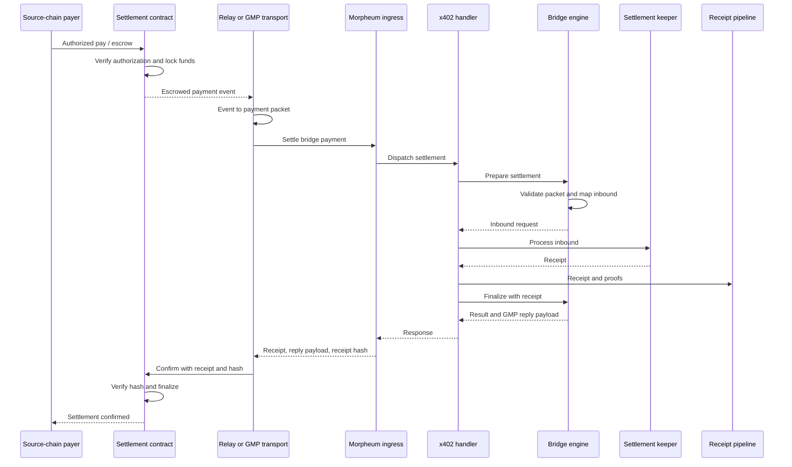
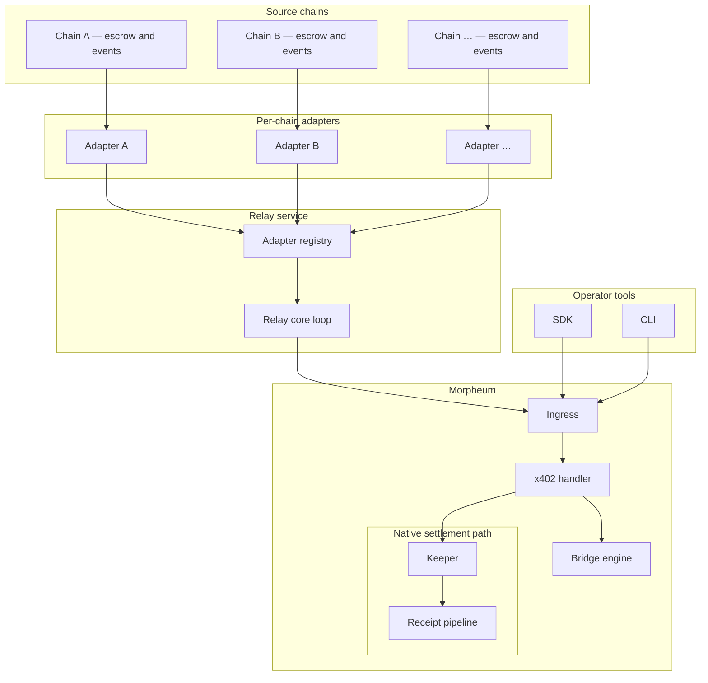
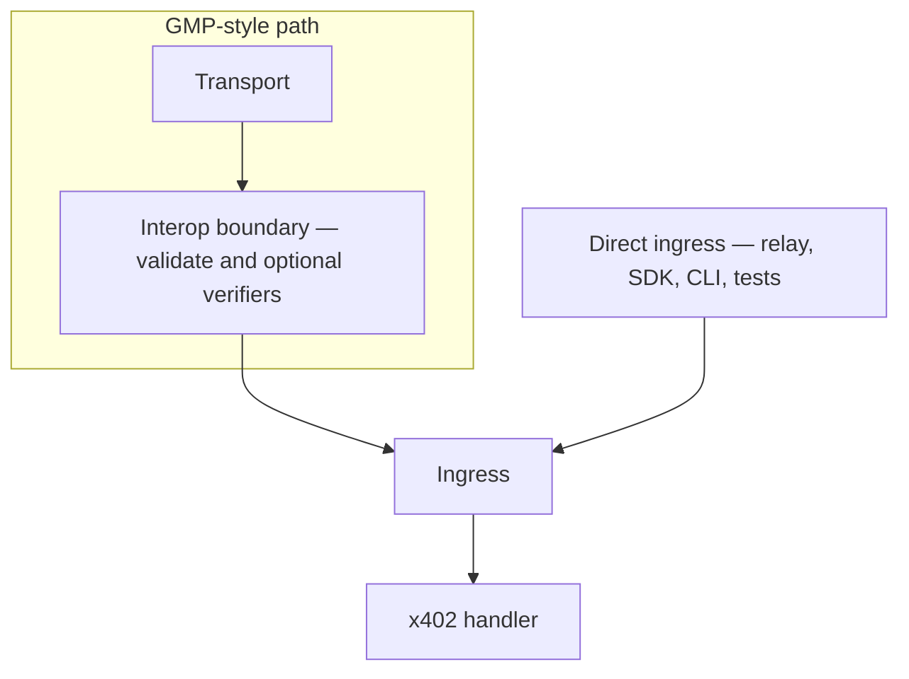
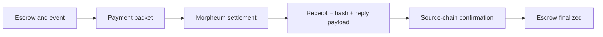

## Introduction

This page describes the **design** of the cross-chain settlement layer for x402 payments from **any source chain** into Morpheum. The architecture is **chain-agnostic**: new chains are supported by plugging in a dedicated adapter for that chain’s settlement and events, without changing the core settlement engine on Morpheum.

**Scope (design only)** — End-to-end settlement flow, major components and their roles, security properties, testing strategy, and operational considerations. It does not list source files, APIs, or executable examples.

**Version**: 3.0 (March 2026)

**Aligned with**: x402 module semantics, x402 security architecture (relayer authorization, signature verification, governance), interop bridge framework, cross-chain settlement and GMP proof bridging, multi-chain signature verification, ERC-8004 as an identity layer, and GMP transports (e.g. LayerZero, Axelar).

If you need baseline HTTP x402 mechanics first, start with [Morpheum x402](/x402).

---

## Overview

Cross-chain x402 settlement connects **source-chain escrow** (where the payer signs and funds are locked) to **Morpheum’s native inbound payment path** (same keeper, caps, receipts, and Merkle pipeline as single-chain payments). A **relay** (or production GMP transport) observes escrow on the source chain, forwards a normalized **payment packet** to Morpheum, receives a **receipt** and **reply payload** for the return trip, and **confirms** settlement on the source chain so funds move from escrow to their final state.

Design highlights:

- **One adapter abstraction per chain** for polling events, building packets, and confirming settlement on that chain.
- **A registry of adapters** keyed by chain identity (CAIP-2 style), so the relay core stays chain-agnostic.
- **A stateless bridge engine** on Morpheum that validates packets, converts them into the native inbound shape, and builds the return payload for GMP.
- **Optional defense-in-depth**: relayer allowlists, optional cryptographic re-verification of payer signatures at the boundary, and source-chain receipt hash checks.
- **Operator surfaces**: SDK and CLI expose the same settlement operation for automation and manual recovery—business logic stays in the shared settlement stack, not duplicated in thin clients.

---

## End-to-end settlement flow

At a high level:

1. On the source chain, the payer authorizes payment; funds move into escrow and an **escrowed payment** event is emitted.
2. The relay (or GMP layer) turns that event into a **payment packet** and submits it to Morpheum’s ingress.
3. Morpheum validates the packet, runs it through the **same inbound path** as native payments, and produces a **receipt**.
4. The relay receives receipt bytes, a **receipt hash**, and a **GMP reply payload** for the return path.
5. On the source chain, the relayer confirms settlement; the contract checks the receipt hash and finalizes state.

---

## Component map (conceptual)

The figures below show **who talks to whom**. The [end-to-end settlement flow](#end-to-end-settlement-flow) section shows the **time order** of messages.

### System topology

Each source chain has its own **adapter** (events, packets, confirmation). Adapters register in a **registry** so a single **relay core** stays chain-agnostic. The relay submits work to **Morpheum ingress**; inside Morpheum, the **handler** drives the **bridge engine** and the same **keeper** and **receipt pipeline** as native payments. **SDK** and **CLI** hit the same ingress for automation and manual operations.

### Interop boundary and ingress

Production **GMP** transports usually deliver messages through the **interop** layer: packets are validated (and optionally signature-checked) before the business handler runs; **return payloads** flow back toward the transport the same way. **Direct ingress** (operators, tests, or a relay speaking gRPC directly) skips that wrapper but should still hit the **same handler semantics**—so behavior stays aligned when you move from test to GMP-backed production.

### Value and proof round-trip

This is the **logical cargo**: escrow on the source chain produces a **packet**; Morpheum returns a **receipt**, a **receipt hash**, and a **GMP reply payload**; the relayer **confirms** on the source chain so escrow can close against a verified receipt.

**Source chain**

- **Settlement contract** — Binds authorization to the payer, escrows stable value, emits events the relay consumes, accepts relayer-only confirmation, enforces timeouts and refunds, and verifies receipt integrity via hash.

**Transport**

- **Relay** — Chain-pluggable loop: poll (or subscribe), normalize to a packet, call Morpheum, confirm on source. In tests, a standalone relay may stand in for production GMP.

**Morpheum**

- **Ingress** — Accepts the bridge settlement transaction and routes it to the x402 handler.
- **x402 handler** — Authorizes the sender as a relayer when configured, optionally verifies signatures, dispatches to the hot path, emits completion events.
- **Bridge engine** — Stateless: validate packet structure, map to inbound request, build GMP reply from receipt and packet metadata.
- **Keeper and pipeline** — Unchanged from native flow: caps, receipt storage, Merkle proofs.

**Interop**

- The interop layer is the home for **multi-chain bridge** concerns. It defines the boundary where packets are validated and optionally signature-checked before handoff to x402, and where **return payloads** are passed back toward the transport. Production GMP integrations route through this layer; direct ingress calls are one way to exercise the same settlement path in tests.

**SDK and CLI**

- **Chain metadata registry** — Human-readable names map to canonical chain identifiers for operator convenience; unknown chains still work if the identifier is supplied explicitly.
- **Client and command-line** — Submit bridge settlement with the same fields the relay uses; the CLI resolves chain names where possible.

---

## Source-chain settlement contract (EVM reference)

On EVM-style chains, the reference design uses **typed structured signing** so the payer’s intent is unambiguous. The payer signs off-chain; on-chain, the contract verifies the signer, enforces deadlines, pulls stablecoins into escrow, and emits an escrow event. Only a **designated relayer** may submit confirmation. Confirmation carries **receipt bytes** and a **cryptographic hash** of those bytes; the contract ensures they match before marking the payment settled. If settlement never arrives, a **timeout** allows the payer to reclaim funds.

**Security properties (design intent)**

| Property | Role |
|----------|------|
| Replay protection | Each payment identifier is consumed once. |
| Signature binding | Authorization is tied to the signer and payment fields. |
| Relayer gating | Only the configured relayer confirms settlement. |
| Receipt integrity | Hash must match receipt bytes. |
| Timeout refunds | Payers are not stranded if the remote leg fails. |

Test networks use **mintable test stablecoins** and local validators; production uses real assets and deployed contracts on live networks.

---

## Morpheum-side path

**Transaction shape** — The bridge settlement operation carries **who is acting as relayer** and the **payment packet** (identifiers, source chain, target agent, amount, asset, memo, signature material, and reply routing hint).

**Handler dispatch**

1. **Relayer authorization** — If an allowlist is configured, the transaction sender must be on it.
2. **Packet extraction** — The packet is the canonical cross-chain payload.
3. **Optional signature verification** — When enabled, the system re-verifies that the signature material matches the claimed payer and digest rules for that chain family.
4. **Hot path** — Delegates to the same inbound processing as native payments.
5. **Response** — Returns success, receipt, serialized **GMP reply payload**, and **receipt hash** for the return trip.
6. **Events** — A completion event is emitted for observability.

**Governance** — Security-critical parameters (allowlists, verification toggles) are updated only through **governance**, not through ordinary business messages.

**Bridge engine (stateless)**

- **Validate** — Structural checks: identifiers, source chain, target agent, positive amount, required fields for signature and reply routing.
- **Map to inbound** — Converts the packet into the same inbound shape native payments use.
- **Prepare** — Validate then map, as a single logical step.
- **Build reply** — Packages receipt bytes, a content hash, routing metadata, and correlation fields for GMP.
- **Finalize** — Combines receipt and packet into the result the handler returns.

**Hot path composition**

Prepare settlement → process inbound through the keeper → finalize with bridge → return result. Cross-chain traffic **converges** on the native engine; it is not a parallel ledger.

**GMP reply payload (logical fields)**

| Field | Purpose |
|-------|---------|
| Reply channel | Routes the return message on the GMP layer. |
| Receipt bytes | Encoded receipt for the source chain. |
| Receipt hash | Integrity check on receipt bytes. |
| Payment id | Correlates with the original payment. |
| Source chain | Echoes CAIP-style chain identity. |

The payload is serialized for transport in a stable binary form.

---

## Interop boundary

Interop exists so **bridge transport** stays separate from **x402 business logic**. At the boundary:

- **Settlement contract (trait-level)** — Interop depends on an abstract “settler” capability so it does not import x402 internals directly; x402 implements that contract.
- **Boundary validation** — Duplicate structural checks before the packet enters x402.
- **Signature verifiers** — Optional pluggable verifiers by chain namespace; if none is registered for a namespace, the system may rely on the relay trust model (documented tradeoff).

In production GMP flows, interop receives the message, validates, forwards to x402, and returns the reply to the transport. Direct ingress remains valid for the same settlement semantics.

---

## Chain-agnostic relay

**Purpose** — Observe escrow on each registered source chain, submit packets to Morpheum, push confirmations back.

**Adapter model** — Each chain implements one **adapter** with a small surface: discover new escrowed payments from a cursor, report chain head, map an event to a payment packet, and confirm settlement on that chain. Heterogeneous adapters sit behind a **type-erased registry** so one relay loop drives all chains.

**Relay core** — Configuration-driven registration, polling intervals, per-adapter cursors, and a single loop that talks to Morpheum’s API. The core has **no** chain-specific logic beyond calling the right adapter.

**Design choices**

- **Standalone service** — Matches production topology (transport as its own process).
- **Polling** — Configurable; production may add subscriptions where available.
- **Library plus binary** — Tests can drive the library without spawning a process.

---

## Adding a new chain (design steps)

1. Implement an adapter for that chain’s events and confirmation semantics.
2. Deploy or reuse a **settlement program** on that chain that escrowed, emits relayer-confirmable events, and verifies return receipts.
3. Register the adapter in the relay configuration.
4. Optionally add a **chain metadata** entry for friendly names in operator tools.
5. Optionally register a **signature verifier** for that chain’s namespace if you rely on Morpheum-side re-verification.

Core Morpheum settlement, packet shape, and client patterns stay stable if the packet and adapter contracts are honored.

---

## Testing strategy (design)

Tests are layered so failures localize to contracts, bridge logic, or transport.

| Layer | Focus |
|-------|--------|
| Contract tests | Escrow, confirmation, refunds, relayer-only paths, replay, concurrency, hash checks, negative cases. |
| Cross-chain E2E | Local chain plus cluster: full round-trip, invalid signatures, replay, receipt tampering, bidirectional and load scenarios. |
| Offline verification | Multi-chain signature libraries: valid chains, forged inputs, algorithm mismatches, digest consistency. |
| SDK / policy E2E | Relayer allowlists, toggling verification, revocation behavior. |
| Digest round-trips | Structured signing on a local chain matched against verifier expectations. |

**No real money** — Local validators, mintable test assets, and the same cluster patterns as other E2E tests. Contract artifacts are built before tests that depend on bytecode; the harness deploys and drives the local chain.

---

## SDK and CLI (roles)

**SDK** — Types for packets and bridge results, request builders with validation, and a client method to submit bridge settlement. Relays and integrators call this programmatically.

**CLI** — Thin wrapper: parse arguments, resolve chain name when provided, build the request, sign and broadcast. Used for debugging and manual recovery.

**Who uses them**

| Actor | Typical use |
|-------|-------------|
| Automated relay | SDK in the hot path |
| Third-party integrator | SDK |
| Operator | CLI for intervention |
| Test harness | SDK for deterministic automation |

Bridge receipts are **normal x402 receipts**; querying them uses the same receipt queries as other payments.

---

## Production vs test (design)

| Concern | Test | Production |
|---------|------|------------|
| Chain | Local validator | Live networks |
| Assets | Mintable test stablecoin | Real stablecoins |
| Transport | Test relay | GMP or production relay service |
| Contracts | Deployed to local chain | Deployed per supported network |
| Relayer keys | Test keys | KMS-backed, allowlisted identities |
| Signature re-verification | Optional | Recommended where policy requires |

Morpheum-side settlement logic is intended to be **environment-agnostic**; differences are in what sits outside (chains, assets, transport).

---

## Security: fake payments and trust

Defense is layered:

1. **Source chain** — Settlement logic rejects bad authorizations and only escrows after success.
2. **Escrow before relay** — Events used by the relay imply funded escrow.
3. **Relayer allowlist on Morpheum** — Optional restriction on who may submit bridge settlement.
4. **Optional signature re-verification** — Payer and digest checks across supported chain families when enabled.
5. **Packet validation** — At interop boundary and inside the bridge engine.
6. **Receipt integrity** — Hash verified on confirmation.
7. **Idempotency** — Payment identifiers prevent double settlement.
8. **Governance** — Security parameters change only through governed processes.

---

## What the test program is meant to show

- Contracts enforce authorization, escrow, timeouts, relayer rules, and receipt hashes.
- Morpheum validates packets, produces receipts with proofs, and returns a coherent reply payload.
- The full path from escrow through Morpheum and back to confirmation works end-to-end.
- Invalid inputs, replays, tampered receipts, and load are rejected or handled safely.

---

## Technology dependencies (names only)

Typical stack: EVM interaction libraries, protobuf-based RPC, async runtime, content hashing, multi-chain cryptography libraries, local chain and contract toolkit, established ERC-20 and signing standards for the EVM reference. Exact versions belong in engineering runbooks, not in this design page.

---

## Chain-agnostic vs chain-specific

**Agnostic** — Packet shape, bridge validation, handler dispatch, keeper, receipt pipeline, interop settler abstraction, SDK/CLI field model, relay core loop.

**Specific** — Per-chain adapter, per-chain settlement program, local test harness for a given VM, and per-namespace signature verifiers where used.

---

## See also

- [Morpheum x402](/x402) — Protocol context, Morpheum architecture, and HTTP flows.
- [Introduction](/) — Morpheum overview and cross-chain positioning.
