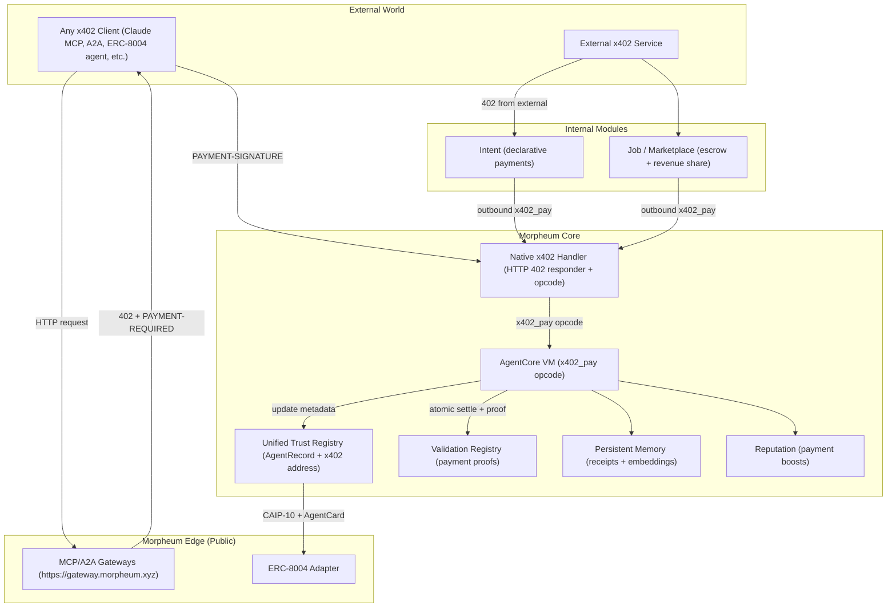
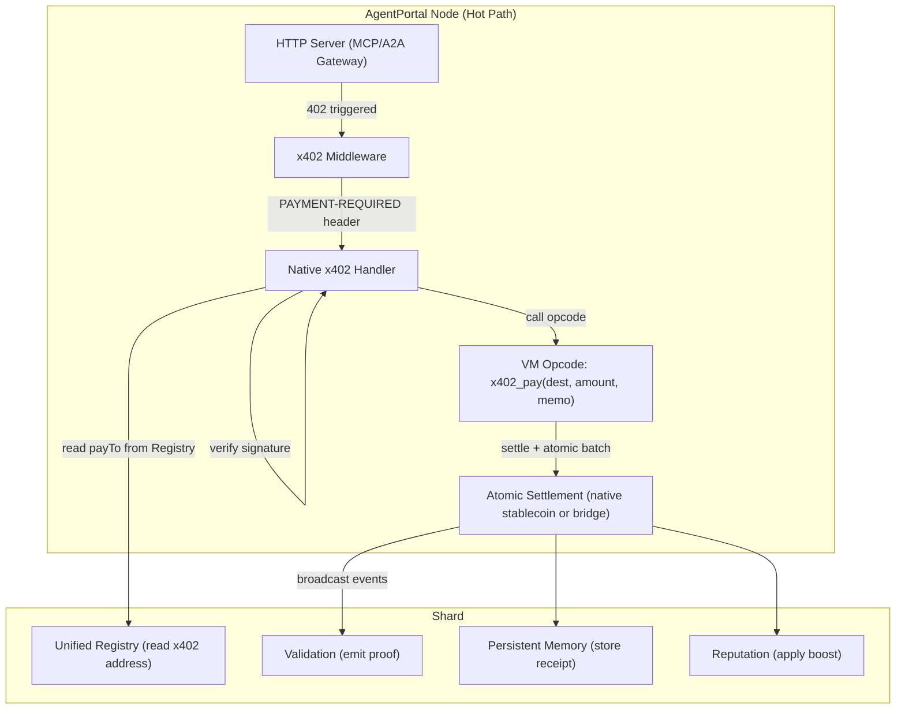
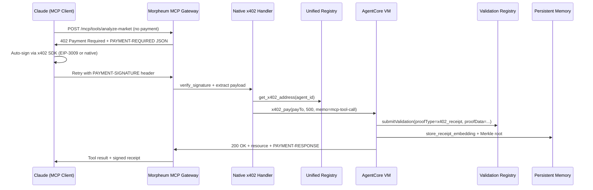
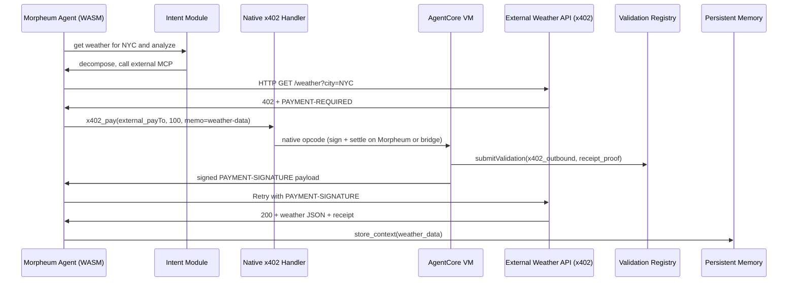
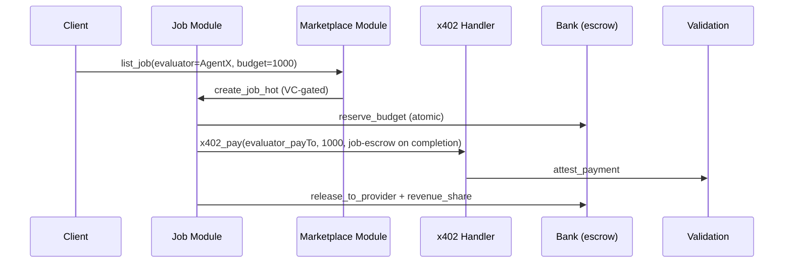
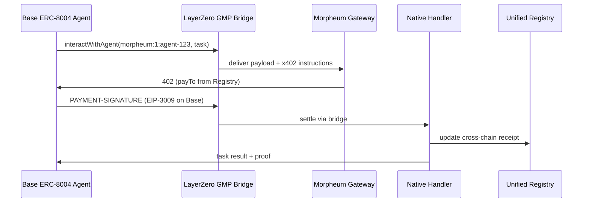

**Morpheum x402 Deep Dive: Native Integration for the Agent Economy**

*Comprehensive Research Document — March 2026 Edition*

*Aligned with Morpheum Pillars 2–4, Unified Trust Registry, Native Core, and All Agent Modules*

---

## Introduction

**x402** is an open, vendor-neutral standard for **machine-readable payments over HTTP**. A client calls an API as usual; if payment is required, the server responds with status **`402 Payment Required`** and structured instructions in headers; the client signs or authorizes payment, retries the same request with a payment header, and receives the resource when settlement succeeds. No separate billing portal is required for the basic flow—making it a natural fit for **autonomous agents**, micro-paywalls, and pay-per-call APIs.

**Why it exists**: The numeric code `402` was defined early in HTTP but rarely used in a interoperable way. x402 specifies **payloads, schemes, and verification** so any client (browser, SDK, or agent) can pay any compliant server in a predictable way, usually with **stablecoins** or other tokenized assets on defined networks.

**General knowledge (quick reference)**

- **HTTP 402**: Means “payment required.” x402 standardizes what the response body *and* headers must carry so clients know amount, asset, network, and payee.
- **Transport, scheme, and network**: The spec separates *how* you talk to the server (typically HTTP), *how* value moves (**scheme**, e.g. `exact` / `exact_evm`), and *where* it settles (**network**, often identified with **CAIP-2** chain IDs).
- **Core headers** (usually Base64-encoded JSON): **`PAYMENT-REQUIRED`** (quote and constraints), **`PAYMENT-SIGNATURE`** (payer authorization), optional **`PAYMENT-RESPONSE`** (settlement or receipt hints).
- **Facilitator**: An optional party that can simulate, sponsor gas, and broadcast transactions; **servers may verify locally** for a more trust-minimized setup.
- **Ecosystem context**: x402 is used next to **MCP** (paid tools and context), **A2A** (agent collaboration), **ERC-8004** (on-chain agent identity and trust), and **DID/VC** (credentials and policy).

**How this document is organized**: Sections **1–10** build **general x402 knowledge** (history, mechanics, examples, ecosystem, use cases, Morpheum alignment, architecture, flows, benefits, roadmap). The section **Production specification — Exact native integration** is the **Morpheum-native** design with diagrams and module-level flows. **Sources** and **See also** close the page.

If you are new to x402, read this introduction and section **1** first; use the quick-reference bullets above when you need a reminder while reading the rest.

---

## 1. What is x402? Overview and History

x402 is an **open, neutral, HTTP-native payment standard** that revives the long-reserved HTTP 402 "Payment Required" status code to enable instant, programmatic, accountless payments directly over the web. Developed by Coinbase and released as an Apache-2.0 open standard (with the independent x402 Foundation formed in partnership with Cloudflare in 2025), it is purpose-built for the agentic internet.

**Core principles** (straight from the neutral spec):

- **Zero friction** — No accounts, API keys, subscriptions, KYC, or sessions.
- **Zero centralization** — Anyone can run a server or facilitator; permissionless.
- **Zero protocol fees** — Only nominal on-chain gas (often sponsored).
- **Instant settlement** (~200 ms on Base/Solana).
- **Agent-first** — Designed for autonomous AI agents to pay (or be paid) for APIs, data, MCP tools, A2A collaboration, or digital content.

It is the **de-facto standard** for machine-to-machine (M2M) payments in 2026, paired with ERC-8004 (on-chain identity/trust), MCP (Model Context Protocol), A2A (Agent2Agent), and DID/VC. Over 97M monthly SDK downloads for related agent stacks already integrate x402.

---

## 2. Core Protocol Mechanics

x402 is **transport-agnostic** but defaults to HTTP (v1/v2 specs). It separates **transport**, **schemes** (how money moves), and **network** (blockchain/rail).

### Primary Flow (Exact Scheme — Most Common)

1. **Client Request** — AI agent (or human) sends standard HTTP request.
2. **402 Payment Required** — Server responds with 402 status + `PAYMENT-REQUIRED` header (Base64-encoded JSON with payment instructions).
3. **Client Pays & Retries** — Agent signs a payment payload and retries with `PAYMENT-SIGNATURE` header.
4. **Server Verifies & Settles** — Server (or facilitator) checks signature, settles on-chain, then returns 200 + resource + optional `PAYMENT-RESPONSE` header.
5. **Receipt** — Optional signed receipt for audit/proof.

**Key Headers** (all Base64 JSON):

- `PAYMENT-REQUIRED`: Scheme, network (CAIP-2), amount, asset (ERC-20/USDC), payTo, maxTimeoutSeconds, extra (transfer method).
- `PAYMENT-SIGNATURE`: Client-signed payload + authorization.
- `PAYMENT-RESPONSE`: Settlement confirmation (optional).

### Supported Schemes (v2)

- **exact** (most used): Exact amount, one-time.
  - `exact_evm`: EIP-3009 (USDC gasless), Permit2 (universal fallback), ERC-7710 (smart accounts).
  - `exact_stellar`: Native Stellar support (added 2026).
- Extensions: Deferred/up-to payments, gas sponsorship, signed offers/receipts.

### Facilitator Role

Optional trusted verifier/settler (Coinbase CDP provides free tier; anyone can run one). Handles simulation, gas sponsorship, and on-chain broadcast. Servers can verify locally for trust-minimized setups.

**Security**: Signature verification + on-chain simulation; no chargebacks; finality in seconds. EVM schemes support Permit2/ERC-7710 for gasless/smart-account UX.

---

## 3. Technical Details (exact_evm Scheme Example)

Payloads are JSON with `x402Version: 2`. Example `PAYMENT-REQUIRED`:

```json
{
  "scheme": "exact",
  "network": "eip155:8453",
  "amount": "10000",
  "asset": "0x833589fCD6eDb6E08f4c7C32D4f71b54bdA02913",
  "payTo": "0x...",
  "maxTimeoutSeconds": 60,
  "extra": { "assetTransferMethod": "eip3009" }
}
```

*Example: `asset` is USDC on Base; `amount` is in token smallest units.*

Client `PAYMENT-SIGNATURE` includes signature + authorization (EIP-3009/ Permit2/ERC-7710 data). Facilitator simulates `transferWithAuthorization` or proxy call before broadcasting.

Full verification/settlement is deterministic and simulatable client-side. SDKs (TS, Go, Python, Java) handle signing, retry logic, and facilitator calls automatically.

---

## 4. x402 in the Broader Ecosystem

- **Partners**: Coinbase (originator), Cloudflare (foundation + MCP/Agents SDK integration), Google (A2A + AP2 extension), Linux Foundation Agentic AI.
- **SDKs**: Official reference in multiple languages; middleware for Express/FastAPI; one-line integration.
- **Adoption**: Already in production MCP gateways, A2A brokers, API paywalls. Pairs perfectly with ERC-8004 for on-chain trust + payments.
- **Future**: v2 adds modular paywall package, more chains (Stellar, SVM), deferred payments.

---

## 5. Applications and Use Cases

**General**:

- Pay-per-request APIs (weather, market data, LLMs).
- Content paywalls (articles, datasets).
- Microservices monetization.
- Proxy/aggregator services.

**Agent-Specific (the killer app)**:

- AI agents autonomously buy tools/context (MCP servers).
- Inter-agent collaboration payments (A2A).
- Data marketplaces (pay for private vectors or proofs).
- Evaluation services (pay evaluators via jobs).
- Cross-chain service access (via CAIP IDs).

---

## 6. How x402 Applies to Morpheum

Morpheum treats x402 as a **first-class native primitive** — not just an adapter. From the Pillar documents:

- **Native Core**: Every Morpheum node runs an **HTTP 402 responder**. Native opcode `x402_pay(destination, amount, memo)` settles instantly (sub-ms, fractions of a cent) using native stablecoin or bridged assets. Automatic receipt generation for A2A/MCP flows.
- **Thin Adapters (Pillar 2)**: MCP/A2A servers auto-respond with 402 and route payments to native handler. x402 payment address stored in Identity metadata.
- **On-Chain Trust Layer (Pillar 3)**: Payment address + receipts are part of ERC-8004 AgentCard/DID. Validation proofs can attest payments.
- **Bridges/Gateways (Pillar 4)**: Public edge gateways (MCP/A2A) enforce x402 for external agents. GMP bridges propagate payment proofs cross-chain.
- **Unified Registry**: One registration → x402 endpoint auto-published everywhere.
- **Agent Modules**: `intent`, `job`, `marketplace`, `vc`, `interop` all trigger/use x402 for declarative payments, job escrows, revenue share, delegation, and cross-chain.

Morpheum is a **native superset**: Exact external interfaces + superior on-chain settlement (no external facilitator needed; validators act as decentralized facilitators).

---

## 7. Morpheum's Native x402 Architecture

- **Server Side (Inbound)**: Gateways/MCP/A2A endpoints run x402 middleware → 402 response with Morpheum payTo (from Identity). Native handler verifies signature → calls `x402_pay` opcode → serves resource + proof.
- **Client Side (Outbound)**: Agents use native opcode or SDK wrapper to sign & pay external x402 services seamlessly.
- **Facilitator**: Optional (use Coinbase for legacy) or **decentralized** via Morpheum validators (TEE/zk attestation of settlement).
- **Storage/Verifiability**: Receipts logged to Persistent Memory + Validation Registry (zk-proof of payment).
- **Security**: VC-gated spending caps, reputation-weighted rate limits, owner kill-switches.

**Integration Points** (zero bloat):

- `agent_registry` & `interop` export x402 endpoints/CAIP payment addresses.
- `memory` stores payment history embeddings.
- `validation` attests receipts as proofs-of-work.
- `reputation` boosts on successful payments/receipts.
- `job`/`marketplace` use x402 for escrows/revenue share.

---

## 8. Detailed Flows in Morpheum

### Outbound (Morpheum Agent → External x402 Service)

1. Agent calls external MCP/A2A API.
2. Receives 402 + PAYMENT-REQUIRED.
3. Native `x402_pay` opcode signs payload → settles on Morpheum (or bridge to target chain).
4. Retries with PAYMENT-SIGNATURE → gets resource + receipt.
5. Receipt auto-stored in memory + validation proof emitted.

### Inbound (External Agent → Morpheum Service)

1. External agent hits Morpheum MCP gateway.
2. Gateway returns 402 (Morpheum payTo from registry).
3. External pays (any x402 scheme).
4. Native handler verifies → serves response + on-chain receipt (ERC-8004 event).

### A2A/MCP Collaboration

- Declarative intent triggers x402 payment for delegated task.
- Job module uses x402 for evaluator payouts.

### Cross-Chain

- GMP bridges propagate payment proofs; CAIP IDs ensure portability.

For cross-chain settlement design (relay, adapters, bridge path, security, and testing strategy), see [Cross-chain x402](/x402/cross-chain).

All flows are **sub-ms** on AgentPortal nodes, atomic with validation/reputation updates.

---

## 9. Benefits & Superpowers for Morpheum

- **Exact compatibility** today with 45k+ ERC-8004 agents + all MCP/A2A clients.
- **10–100× better** than EVM/Solana: Native settlement (no gas wars, TEE/zk proofs), cheap blob storage for receipts, shard-local execution.
- **Future-proof**: Add new schemes (e.g., Stellar) via one adapter; evolve faster than Ethereum while staying 100% compatible.
- **Economic Moat**: Morpheum becomes the **settlement hub** — agents register once, pay/get paid everywhere, with superior privacy/performance.
- **Agent Economy Winner**: Turns every Morpheum agent into a monetizable service; powers pay-per-use inference, data, evaluation, and collaboration at internet scale.

---

## 10. Roadmap & Extensibility (Morpheum-Specific)

**Phase 0 (Testnet 1)**: Native handler + opcode + gateway middleware (already in Pillar 2 plan).

**Phase 1**: Auto-receipts in Validation + memory; ERC-8004 metadata sync.

**Phase 2**: Decentralized facilitator (validator TEEs); v2 schemes (deferred, ERC-7710 smart accounts).

**Phase 3**: Contribute to x402 Foundation (reference non-EVM implementation).

**Recommended Stack**: Official x402 SDKs (wrapped) + native opcode for settlement + Unified Registry for discovery.

**Next Steps for Morpheum Team**:

1. Implement native `x402_pay` opcode + responder (2 weeks).
2. Wire into MCP/A2A gateways and ERC-8004 AgentCard.
3. Open-source Morpheum x402 extensions — become the reference for sovereign L1s.

Morpheum + x402 = the **trustless, instant, agent-native payment rail** the entire economy has been waiting for. One registration. Pay/get paid anywhere. The machine economy runs on Morpheum.

---

## Production specification — Exact native integration

**Morpheum x402 Architecture: Exact Native Integration**

*Production-Ready Specification — March 2026 Edition*

*Fully Aligned with Native Core, Thin Adapters (Pillar 2), Unified Trust Registry (Pillar 3), Bridges/Gateways (Pillar 4), and All Agent Modules*

---

### 1. High-level architecture overview

Morpheum treats **x402 as a first-class native primitive**, not an external adapter. Every validator and AgentPortal node runs a built-in **HTTP 402 responder**. Settlement is handled by a single native VM opcode (`x402_pay`) that is atomic with validation, reputation, memory, and registry updates.



**Core Principles**:

- **Exact external interfaces** (same 402 headers, schemes, JSON payloads).
- **Native superset** — settlement is sub-ms, deterministic, shard-local, with TEE/zk attestation.
- **One registration** → x402 endpoint auto-published in ERC-8004 AgentCard, A2A Card, MCP manifest, DID document.
- **No external facilitator required** — Morpheum validators act as decentralized facilitators (optional Coinbase CDP fallback).

---

### 2. Native x402 handler architecture (inside every node)



**Implementation Location**:

- `crates/node/services/x402.rs` (middleware + responder)
- `crates/runtime/vm/host_functions.rs` (native opcode)
- `crates/modules/interop` + `agent_registry` (CAIP export + receipt proof)

**Supported Schemes** (exact match to x402 v2 spec):

- `exact_evm` (EIP-3009, Permit2, ERC-7710)
- `exact` (native Morpheum settlement — fastest)
- Future: Stellar, deferred payments

---

### 3. Granular inbound flow (external agent → Morpheum service)

**Example 1: External Claude MCP Client Pays for Morpheum Tool**



**Exact Headers in Morpheum Response** (100% spec-compliant):

```text
PAYMENT-REQUIRED: eyJzY2hlbWUiOiJleGFjdCIsIm5ldHdvcmsiOiJtb3JwaGV1bToxIiwiYW1vdW50IjoiNTAwIiwiYXNzZXQiOiJ1c2RjIiwicGF5VG8iOiIweD...}
```

**Timing**: Entire flow &lt;80 µs on AgentPortal node (hot-path verification + opcode).

---

### 4. Granular outbound flow (Morpheum agent → external x402 service)

**Example 2: Morpheum Agent Pays External API for Weather Data (A2A Collaboration)**



**Native Opcode Signature** (exposed to WASM agents):

```rust
fn x402_pay(destination: CAIP10Address, amount: u64, memo: String) -> Result<PaymentReceipt>
```

---

### 5. Cross-module interactions (granular)

**Example 3: Job Marketplace Payment (Escrow + Evaluator Payout)**



**Example 4: Cross-Chain ERC-8004 Agent Pays Morpheum (via Bridge)**



---

### 6. Security, verification & best practices

- **Verification**: Signature + on-chain simulation (EVM schemes) or native opcode atomicity.
- **Caps & Safety**: VC-gated spending limits, reputation-weighted rate limits, owner kill-switch.
- **Proofs**: Every payment generates a Validation Registry entry (zk/TEE attested).
- **Privacy**: Receipts are zk until optionally revealed.
- **Sybil Resistance**: Tied to ERC-8004 identity + reputation.

**Auditable Events** (all emitted):

- `X402PaymentReceived`
- `X402PaymentSent`
- `X402ReceiptStored`

---

### 7. Implementation status & roadmap (direct from pillars)

- **Already in Native Core**: HTTP 402 responder + `x402_pay` opcode (Pillar 2).
- **Unified Registry**: Auto-publishes x402 address (Pillar 3).
- **Gateways**: Public MCP/A2A endpoints enforce x402 (Pillar 4).
- **Testnet 1 Goal**: Full inbound/outbound + ERC-8004 sync.
- **Mainnet**: Decentralized validator facilitators + v2 deferred payments.

This architecture makes Morpheum the **settlement and trust hub** for the entire agent economy — exact x402 compatibility today, native superiority tomorrow.

**Ready to code?** The full Rust skeletons (`x402_handler.rs`, opcode, middleware) are one command away. Ship the payment rail that powers every agent interaction.

---

## Sources

Official x402.org, Coinbase CDP docs, GitHub repo/specs (exact_evm, v1/v2), Cloudflare partnership announcements, and Morpheum Pillar/Module documents.

---

## See also

- [Cross-chain](/x402/cross-chain) for settlement architecture, CAIP identifiers, and GMP flows.
- [Agent wallet](/agent-wallet) for funded agent calls.
- [MCP](/mcp) when exposing Morpheum actions as tools behind a payment gate.
